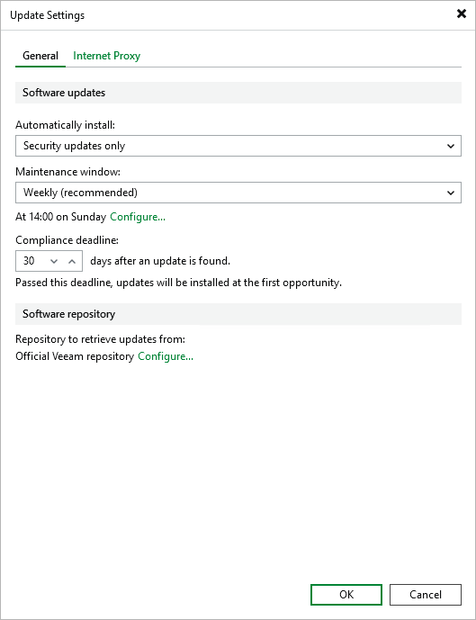
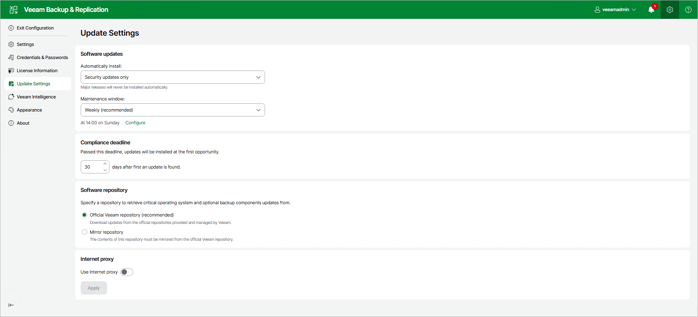
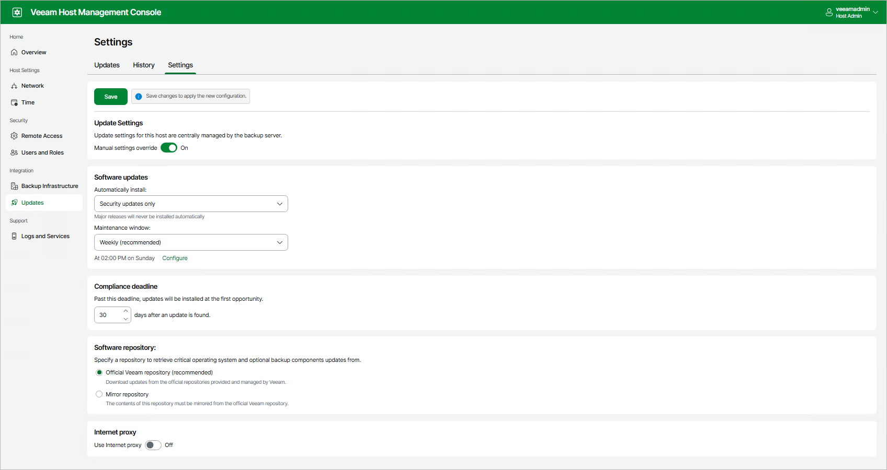

# Configuring Updates

You can use the following update configurations:

* [Global update configuration](#global_configuration)
* [Custom update configuration](#custom_configuration)

Setting Up Global Update Configuration

The global update configuration is applied to all backup infrastructure components deployed from Veeam Software Appliance or Veeam Infrastructure Appliance and added as managed servers. You can set up this configuration in the Veeam Backup & Replication console or the Veeam Backup & Replication web UI. Changes you make are applied to involved backup infrastructure components and synchronized automatically between the web UI and the Veeam Backup & Replication console.

|  |
| --- |
| Note |
| Veeam Updater does not synchronize update configuration changes with outdated backup infrastructure components. |

If you use the Veeam Backup & Replication console, perform the following steps:

1. In the main menu, click Updates > Update Settings.
2. On the General tab, configure the following settings:

* Updates for automatic installation. By default, only security updates are installed automatically. You can also include optional updates, except for major releases.
* Maintenance window. You can schedule automatic update installation to run on a weekly or monthly basis. If you want to install updates manually, select None.

Update schedule is based on the time zone of the backup server. All infrastructure components that use the global configuration are updated simultaneously even if they are in a different time zone.

* Compliance deadline. By default, updates you selected for automatic installation are forcibly installed after 30 days. You can postpone this operation up to 90 days.

The date of the first found update is used as the start date for calculating compliance deadline. When the compliance deadline is reached, Veeam Updater installs all available updates selected for automated installation.

|  |
| --- |
| Important |
| Consider the following:   * If you select manual installation in the maintenance window, mandatory updates will be still automatically installed when the compliance deadline is reached. * If you schedule automatic update installation or miss the compliance deadline, updates will be installed even if you have running jobs. Backup or recovery operations performed by these jobs will fail. |

* Software repository. By default, updates are installed from the Veeam official repository (https://repository.veeam.com/vsa). If your backup server does not have internet access, you can specify a local mirror of the Veeam repository, for example, https://repository.tech.local. For the HTTPS repository, you also need to specify a certificate.

1. On the Internet Proxy tab, add the proxy server if you use one.
2. Click OK.

If you use the Veeam Backup & Replication web UI, perform the following steps:

1. At the top right corner, click Configuration. Then, click Update Settings.
2. Configure the following settings:

+ Updates for automatic installation. By default, only security updates are installed automatically. You can also include optional updates, except for major releases.
+ Maintenance window. You can schedule automatic update installation to run on a weekly or monthly basis. If you want to install updates manually, select None.

Update schedule is based on the time zone of the backup server. All infrastructure components that use the global configuration are updated simultaneously even if they are in a different time zone.

* Compliance deadline. By default, updates you selected for automatic installation are forcibly installed after 30 days. You can postpone this operation up to 90 days.

The date of the first found update is used as the start date for calculating compliance deadline. When the compliance deadline is reached, Veeam Updater installs all available updates selected for automated installation.

|  |
| --- |
| Important |
| Consider the following:   * If you select manual installation in the maintenance window, mandatory updates will be still automatically installed when the compliance deadline is reached. * If you schedule automatic update installation or miss the compliance deadline, updates will be installed even if you have running jobs. Backup or recovery operations performed by these jobs will fail. |

* Software repository. By default, updates are installed from the Veeam official repository (https://repository.veeam.com/vsa). If your backup server does not have internet access, you can specify a local mirror of the Veeam repository, for example, https://repository.tech.local. For the HTTPS repository, you also need to specify a certificate.
* Internet proxy. Add the proxy server if you use one.

1. Click Apply.

Setting Up Custom Update Configuration

The custom update configuration has a higher priority over global settings and is applied to a specific backup infrastructure component deployed from Veeam Software Appliance or Veeam Infrastructure Appliance and added as managed servers. You can set up this configuration in the Veeam Host Management console or Veeam Updater.

To use the custom update configuration for the specific backup infrastructure component, perform the following steps:

1. Log in to the Veeam Host Management console installed on this backup infrastructure component.
2. In the management pane, click Updates.
3. On the Settings tab, set the Manual settings override toggle to On and configure custom update settings. For more information about settings, see [Managing Global Update Configuration](#global_configuration).
4. Click Save.

|  |
| --- |
| Tip |
| If you want to use a custom update configuration for Veeam Backup & Replication itself, use the Veeam Host Management console or Veeam Updater installed on the backup server. In this case, global update configuration will be applied only to backup infrastructure components deployed from Veeam Infrastructure Appliance. |

