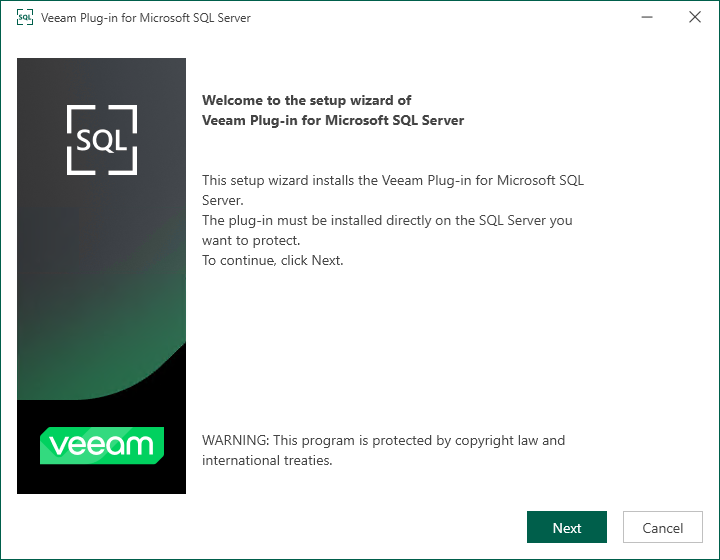
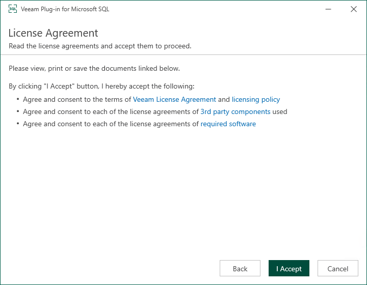
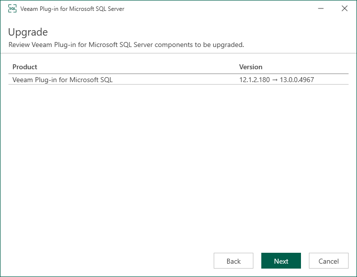
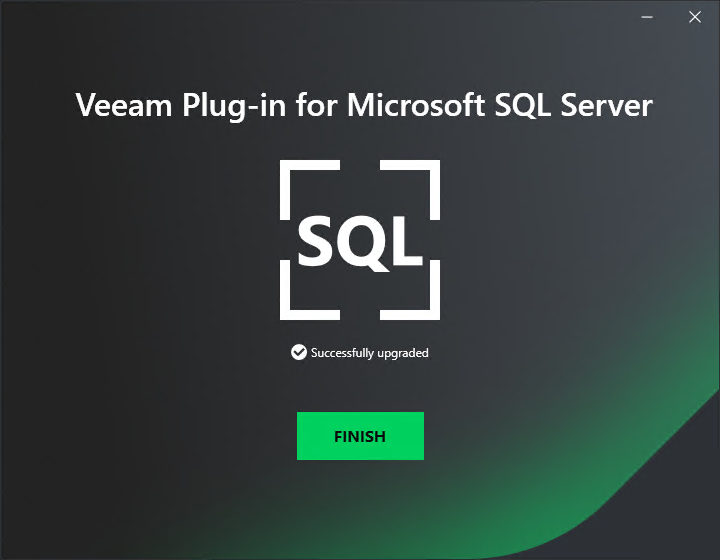

# Upgrading Veeam Plug-In for Microsoft SQL Server

Periodically, Veeam releases a new version of Veeam Backup & Replication that contains new features and bug fixes. The release package also contains a new version of Veeam Plug-Ins.

Veeam Backup & Replication 13 supports different versions of Veeam Plug-In depending on which OS is running on the backup server:

* Veeam Backup & Replication on Linux supports management of Veeam Plug-Ins 13. Management of previous versions of Veeam Plug-Ins is not supported.
* Veeam Backup & Replication on Microsoft Windows supports management of Veeam Plug-Ins 12.3.2.4165 and later.

Note that Veeam Backup & Replication must be the same or later than the version of Veeam Plug-In. If you want to use the latest functionality, you must upgrade both Veeam Backup & Replication and Veeam Plug-In to the latest version. If you use an earlier Veeam Plug-In build, it may not have all the features and bug fixes introduced in your Veeam Backup & Replication version. To learn more about the Veeam Plug-In builds included in Veeam Backup & Replication installation ISO files, see [this Veeam KB article](https://www.veeam.com/kb4474).

|  |
| --- |
| Important |
| Consider the following:   * You must upgrade Veeam Backup & Replication before you upgrade Veeam Plug-Ins. To learn how to upgrade Veeam Backup & Replication, see [Upgrade and Update](vbr_updating.md).  * Before you upgrade Veeam Plug-In, check [System Requirements](system_requirements_mssql.md). Make sure Microsoft SQL Server Management Studio requirements are met. |

For instructions on how to upgrade Veeam Plug-In for Microsoft SQL Server, see:

* [Upgrading Veeam Plug-In](#upgrade)
* [Upgrading Veeam Plug-In in Unattended Mode](#unattended)

Upgrading Veeam Plug-In

Veeam Plug-In installation files are included in the installation image of Veeam Backup & Replication and available for download from [veeam.com](https://www.veeam.com/products/data-platform-trial-download.html?tab=application-plugins).

1. Upload the installation files to Microsoft SQL Server. To do this, perform the following steps:

Using the Veeam Backup & Replication installation image

1. Mount the Veeam Backup & Replication installation image.

You can download the latest version of the Veeam Backup & Replication installation image from [this Veeam webpage](https://www.veeam.com/products/data-platform-trial-download.html).

1. In the installation disk folder, navigate to the Plugins\Microsoft SQL\x64\ folder.

1. Upload the VeeamPluginforMSSQL.exe file to Microsoft SQL Server.

Using veeam.com

1. Download the setup archive for Veeam Plug-In for Microsoft SQL Server from [this Veeam webpage](https://www.veeam.com/products/data-platform-trial-download.html?tab=application-plugins).
2. In the setup archive, find the VeeamPluginforMSSQL.exe file.
3. Upload the VeeamPluginforMSSQL.exe file to Microsoft SQL Server.

1. After you uploaded the files, you can upgrade Veeam Plug-In. To do this, open the setup archive and run the VeeamPluginforMSSQL.exe file to launch the installation wizard.
2. At the welcome screen of the installation wizard, click Next.

1. At the License Agreement step of the wizard, follow the links to view license agreements and click I Accept.

1. At the Upgrade step of the wizard, review Veeam Plug-In for Microsoft SQL Server components to be upgraded and click Next.

1. Wait for the upgrade process to complete and click Finish to exit the wizard.

Upgrading Veeam Plug-In in Unattended Mode

You can upgrade Veeam Plug-In for Microsoft SQL Server to a later version in the unattended mode using the same command that is used for unattended installation. For details, see [Installing Veeam Plug-In in Unattended Mode](install_mssql_unattended.md).

