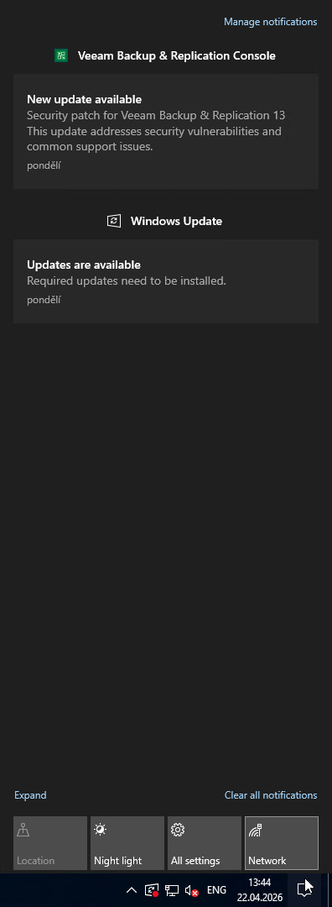
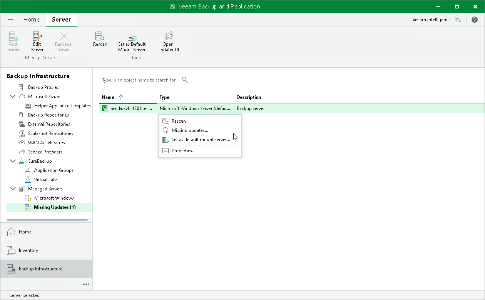

# Checking Updates

Veeam Backup & Replication automatically notifies you about updates that must or can be installed to enhance your work experience with the product. Update notifications eliminate the risk of using out-of-date components in the backup infrastructure or missing critical updates that can have a negative impact on data protection and disaster recovery tasks.

After a new build of Veeam Backup & Replication is published on the Veeam update server, the backup console will display a notification in the Windows Action Center (or an icon in the system tray for earlier Windows versions). If the update is not installed, this notification will keep appearing once a week as a reminder.

You can also see available updates in the Managed Servers > Missing Updates node in the Backup Infrastructure view.

The update notifications are enabled by default.

Veeam Backup & Replication notifies about new Veeam Backup & Replication product versions and updates, as well as about hypervisor updates, fixes and patches that should be installed on Microsoft Hyper-V hosts and off-host backup proxies for correct work of Veeam Backup & Replication with Microsoft Hyper-V.

How Update Notification Works

To check for updates, Veeam Backup & Replication uses a special XML file on the Veeam Update Notification Server (dev.veeam.com). The XML file contains information about the most up-to-date product version and updates.

Veeam Backup & Replication downloads an XML file from the Veeam Update Notification Server once a week. It also collects information about the installed product and updates installed on Hyper-V hosts. The collected information is compared with the information in the downloaded file. If new product versions and updates are available, Veeam Backup & Replication informs you about them.

|  |
| --- |
| Note |
| Make sure that the backup server is connected to the internet and update notification is enabled in Veeam Backup & Replication options. In the opposite case, update notification will not function. |

Installing Updates

To install a product update, double-click the Veeam Backup & Replication notification in the Windows Action Center (or an icon in the system tray for earlier Windows versions). Veeam Backup & Replication will open a KB webpage with the update description and links to the installation archive of the new product version or new update.

[For Microsoft Hyper-V] If a Microsoft Hyper-V host or off-host backup proxy added to the backup infrastructure misses important hypervisor fixes and patches that can potentially affect work of Veeam Backup & Replication, Veeam Backup & Replication displays a warning icon over the host or off-host proxy in the inventory pane.

To install updates:

1. In the Backup Infrastructure view, select a host or off-host backup proxy and click Missing Updates on the ribbon.
2. Use the Missing Updates window to manage updates:

+ To install an update, click the update link. Veeam Backup & Replication will open a webpage with the update description and download link.
+ To ignore the update, select it in the list and click Dismiss. Veeam Backup & Replication will remove the update from the list and will not inform you about it anymore. To ignore all updates, click Dismiss All.
+ To bring the list of updates to its initial state, click Re-Check. Veeam Backup & Replication will display all updates, including those that have been dismissed.
+ To copy update list details, click Copy to Clipboard.

|  |
| --- |
| Tip |
| Beside hypervisor updates, in the Missing Updates list Veeam Backup & Replication displays information about new Veeam Backup & Replication versions and patches. Click the link in the list, and Veeam Backup & Replication will open a webpage with the product update description and links to the installation archive. |

