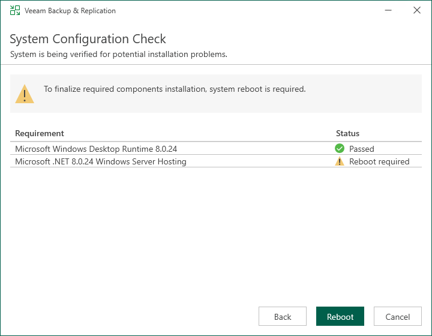

# Step 4. Perform Configuration Check

At the System Configuration Check step of the wizard, the setup checks the Veeam Backup & Replication configuration.

If the check returns errors, solve their causes before continuing the update.

If the check returns warning or information messages, you can continue the update and address them later. However, we recommend that you closely investigate warning and information messages: if not properly addressed, their causes may lead to serious problems with further system operation.

To view the details of a certain message, point the cursor to the line with the message. The dialog box will display the detailed description.

