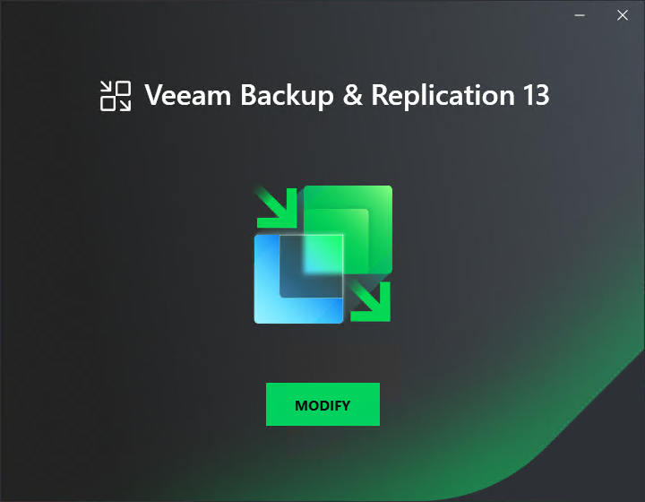

# Step 1. Start Update Wizard

To start the update wizard, take the following steps:

1. Download the Updated ISO from [this Veeam KB article](https://www.veeam.com/kb4738).
2. Mount the installation image to the machine where Veeam Backup & Replication is installed, or burn the image file to a flash drive or other removable storage device. If you plan to upgrade Veeam Backup & Replication on a VM, use built-in tools of the virtualization management software to mount the image to the VM.

To extract the content of the ISO, you can also use the latest versions of utilities that can properly extract data from ISO files of large size and can properly work with long file paths.

1. After you mount the image or insert the disk, Autorun opens a splash screen. If Autorun is not available or disabled, run the Setup.exe file from the image or disk.
2. Click Modify.

