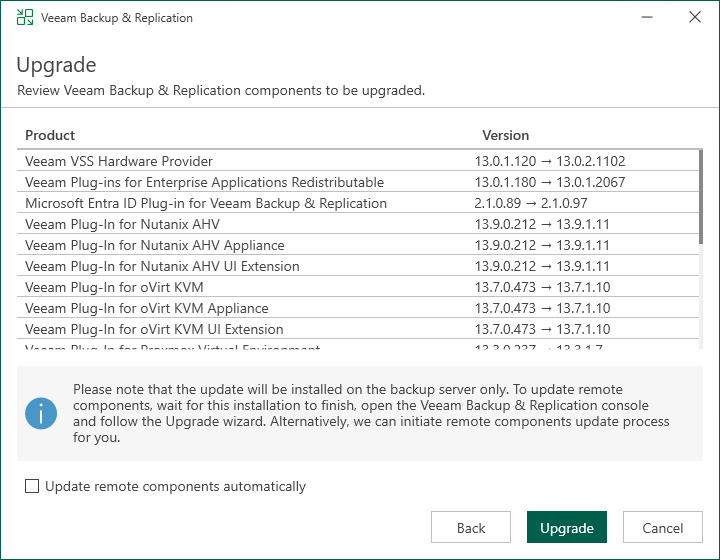

# Step 5. Review Components and Begin Update

At the Upgrade step of the wizard, you can review the components that will be upgraded.

To upgrade the remote backup infrastructure components and required Veeam services after the Veeam Backup & Replication server is upgraded, select the Update remote components automatically check box. Otherwise, the backup server will prompt you to upgrade them during the first run of the backup server after the update.

Click Next to begin the update process.

