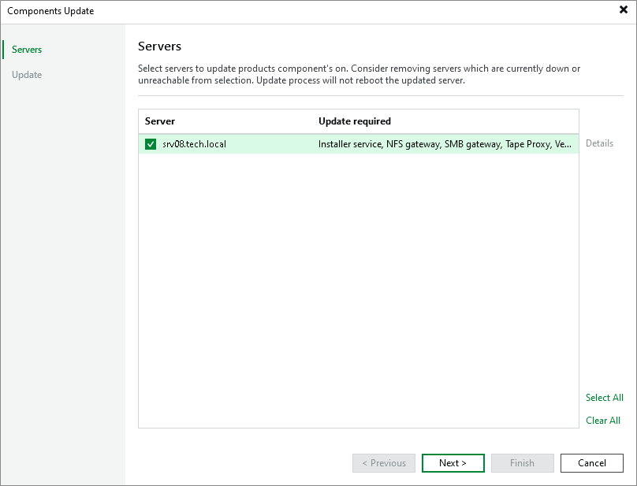

# Updating Tape Servers

Every time you launch Veeam Backup & Replication, it automatically checks if the components installed on managed servers are up to date. You will be unable to work with tape libraries that are connected to the outdated servers.

If there is a later version of a component available (usually, if you have upgraded Veeam Backup & Replication), the Components Update window will be displayed, prompting you to update components on managed tape servers.

You can also open the Components Update window by doing one of the following:

* Open the main menu and select Upgrade from the main menu.
* Open the Tape Infrastructure view, select the Servers node and click Upgrade on the ribbon.
* Open the Tape Infrastructure view, right-click the necessary tape server in the working area and select Upgrade.

If components on all managed servers are up to date, the Upgrade item will be disabled.

The Components Update section lists tape servers that have outdated components deployed. To see the current and the latest available versions for deployed components, select a server in the list and click Details. Select check boxes next to servers for which you want to upgrade components and click Apply.

