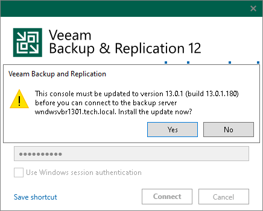

# Upgrading Veeam Backup & Replication Console

In this article

To perform upgrade of Veeam Backup & Replication console to version 13.0.1, you must be running version 12.3.1 (build 12.3.1.1139) or later on the supported operating system (refer to the [System Requirements](system_requirements.md#console) section of this document). For information on upgrade from earlier versions, see [this Veeam KB article](https://www.veeam.com/kb2053).

Use the Veeam Backup & Replication Console Upgrade wizard to install the product.

1. [Start the upgrade wizard](upgrade_vbr_launch.md).
2. [Select the Veeam Backup & Replication console as a component to upgrade](upgrade_vbr_select_component.md).
3. [Read and accept the license agreement](upgrade_vbr_license_agreement.md).
4. [Install missing software](upgrade_console_system_configuration_check.md).
5. [Review the components that will be upgraded and begin the upgrade process](upgrade_vbr_upgrade.md).

There is an alternative method to upgrade the Veeam Backup & Replication console. If you connect the remote console to the backup server of a later version, the console requests the upgrade. Click Yes to upgrade it to the version of the backup server.

|  |
| --- |
| Important |
| The alternative method of the upgrade is applicable only for the Veeam Backup & Replication console version 12.3.2 P1 (build 12.3.2.4165). |

|  |
| --- |
| Note |
| You cannot downgrade the Veeam Backup & Replication console by connecting to a backup server of an earlier version. In this case, you have to either upgrade the backup server to the version of the console or reinstall the console of an earlier version. |

You can also use this approach to install minor updates on the Veeam Backup & Replication console.

Page updated 11/7/2025

Page content applies to build 13.0.1.1071
