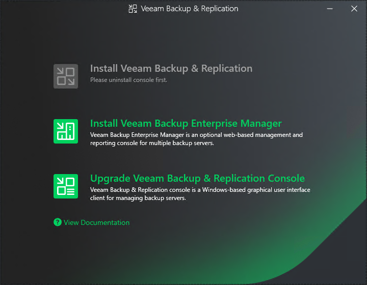

# Step 2. Select Component

In this article

At this step of the wizard, select Upgrade Veeam Backup & Replication Console.

To open Veeam Help Center from the upgrade wizard, click View Documentation.

Page updated 10/22/2025

Page content applies to build 13.0.1.1071
