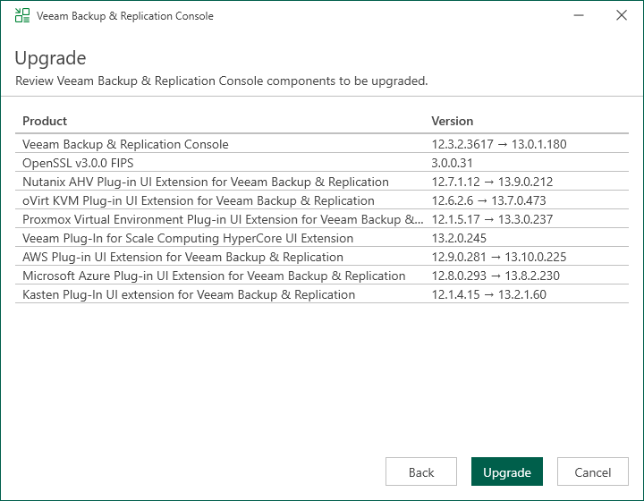

# Step 5. Review Components and Begin Upgrade

In this article

At the Upgrade step of the wizard, you can review the components that will be upgraded.

To also upgrade the the remote components after the Veeam Backup & Replication server is upgraded, select the Update remote components automatically check box.

Click Upgrade to begin the upgrade process.

Page updated 11/10/2025

Page content applies to build 13.0.1.1071
