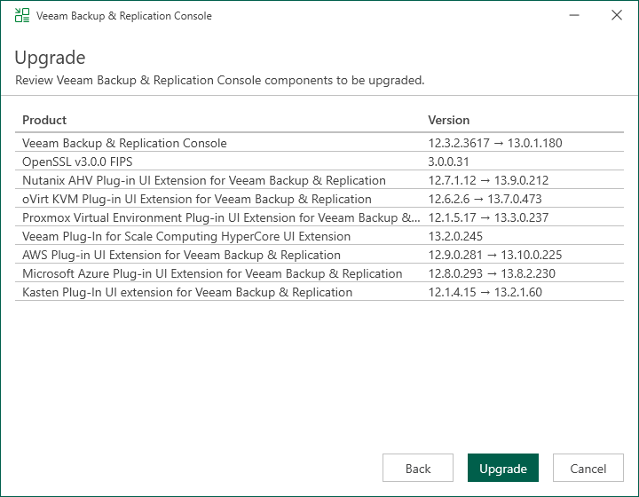

# Step 5. Review Components and Begin Upgrade

At the Upgrade step of the wizard, you can review the components that will be upgraded.

To also upgrade the remote components after the Veeam Backup & Replication server is upgraded, select the Update remote components automatically check box.

Click Upgrade to begin the upgrade process.

Page updated 2026-07-23

