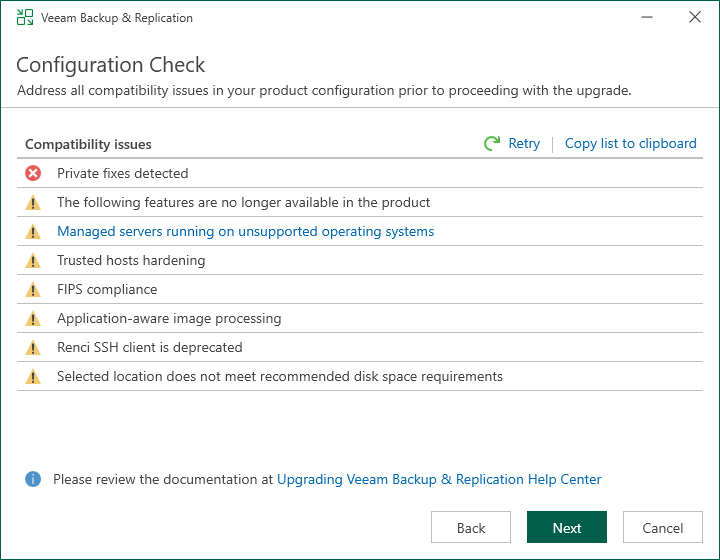

# Step 6. Perform Configuration Check

At the Configuration Check step of the wizard, the setup checks the Veeam Backup & Replication configuration.

If the check returns errors, solve their causes before continuing the upgrade. After you solve them, click Retry to check if there are any issues left.

If the check returns warning or information messages, you can continue the upgrade and address them later. However, we recommend that you closely investigate warning and information messages: if not properly addressed, their causes may lead to serious problems with further system operation.

To view the details of a certain message, point the cursor to the line with the message. The dialog box will display the detailed description.

To copy a list of detected issues with detailed descriptions for further investigation, click Copy list to clipboard.

