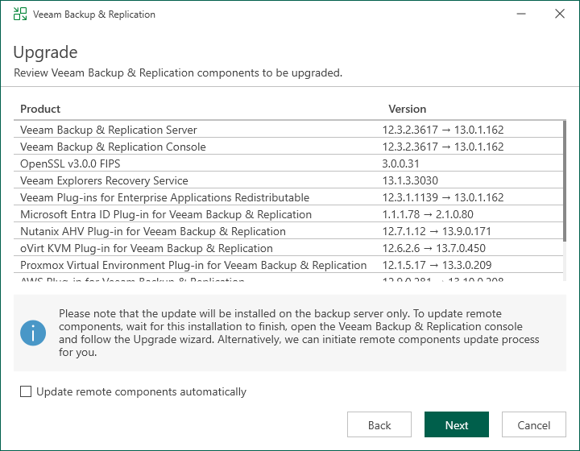

# Step 7. Review Components and Begin Upgrade

In this article

At the Upgrade step of the wizard, you can review the components that will be upgraded.

To upgrade the remote backup infrastructure components and required Veeam services after the Veeam Backup & Replication server is upgraded, select the Update remote components automatically check box. Otherwise, the backup server will prompt you to upgrade them during the first run of the backup server after the upgrade.

Click Next to begin the upgrade process.

Page updated 10/22/2025

Page content applies to build 13.0.1.1071
