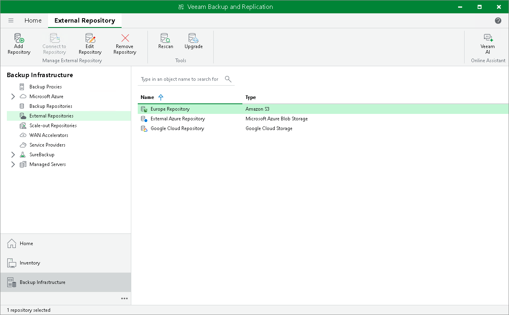

# Upgrading External Repositories

In this article

When you upgrade an external repository, a new version of [Veeam Data Mover](veeam_transport_service.md) is uploaded to the gateway server. Veeam Data Mover is responsible for handling ingress/egress requests that are sent to/from the gateway server during working with the external repository data in Veeam Backup & Replication.

Upload of Veeam Data Mover is done directly to a gateway server which you specify at the [Account](external_repository_account.md) step of the New External Repository wizard.

To upgrade an external repository:

1. Open the Backup Infrastructure view.
2. In the inventory pane, click External Repositories.
3. Select a repository you want to upgrade and click Upgrade on the ribbon menu or right-click a repository and select Upgrade.

Page updated 8/26/2025

Page content applies to build 13.0.1.1071
