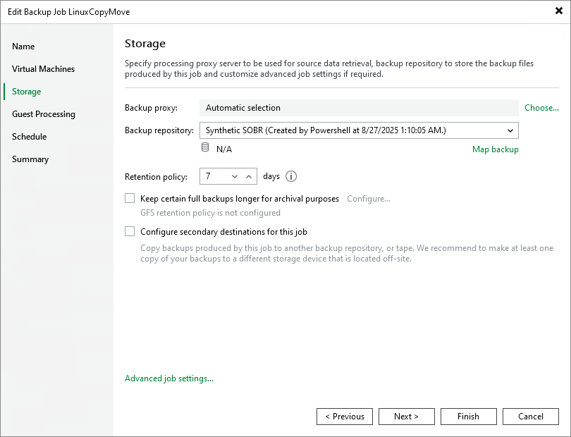

# Upgrading Performance Extent to Hardened Repository

|  |
| --- |
| Important |
| A Veeam Infrastructure Appliance used as a performance extent cannot be upgraded to a hardened repository. |

If you have Linux servers added as performance extents to a scale-out backup repository (SOBR), you can upgrade the extents to hardened repositories. To do this, perform the following steps:

1. Disable all backup jobs that use the SOBR. For more information, see [Disabling Jobs](disabling_jobs.md).

|  |
| --- |
| Note |
| If you have Veeam Agent backup jobs managed by Veeam Agent, you need to delete these jobs and configure them again after you switch to the hardened repository. |

1. Switch all Linux extents in the SOBR to maintenance mode. For more information, see [Switching to Maintenance Mode](sobr_maintenance.md).
2. On each Linux extent, change permissions for the directory where the backups are stored. Both owner and group must be the account with non-root permissions you use to connect to the Linux extent.

|  |
| --- |
| chown -R owner:group <dir\_path> |

1. Go to the Veeam Backup & Replication console and perform the following steps:

1. Open the Backup Infrastructure view and select Managed Servers in the management pane. For each Linux extent, specify the account with non-root permissions you use to connect to the Linux extent. These credentials must be single-use. To do this, right-click the Linux extent, select Properties and go the Access step of the wizard.
2. Remove the backup files stored on all Linux extents from the backup configuration.To do this, go to the Backups > Disk node and select a backup file. Hold [Ctrl] and right-click the file. Then, select Remove from Configuration.

|  |
| --- |
| Important |
| Removing backups from configuration is designed for experienced users only. It is strongly recommended to create [encrypted configuration backup](config_backup_encrypted.md) before performing this operation. |

1. Add each Linux extent to the backup infrastructure as a hardened repository using the New Backup Repository wizard. For more information, see [Adding Hardened Repositories](hardened_repository_add.md).

1. Go to the Performance Tier step of the Edit Scale-out Repository wizard and remove all Linux extents. Then, add the newly-created hardened repositories. Go to the last step of the wizard, click Apply.
2. Open the Backup Infrastructure view and select Scale-out Repositories in the navigation pane. Right-click the SOBR and select Rescan. Any backup files stored on the added repositories will be automatically imported and displayed in the Veeam Backup & Replication console under the Imported > Backups node.

|  |
| --- |
| Note |
| If you work with encrypted backups, you need to decrypt them after importing. For more information, see [How Data Decryption Works](decryption_hiw.md). |

1. Go to the Jobs node and edit the jobs associated with the SOBR. At the Storage step of the wizard, select the SOBR from the backup repository list.

Select Map Backup and map the job to the corresponding imported backup. Finish the wizard to apply changes. Repeat this process for each backup job using the SOBR.

1. Re-enable the jobs that you disabled on the SOBR.
2. Open the Backup Infrastructure view and remove the unused Linux repositories from the backup infrastructure.

