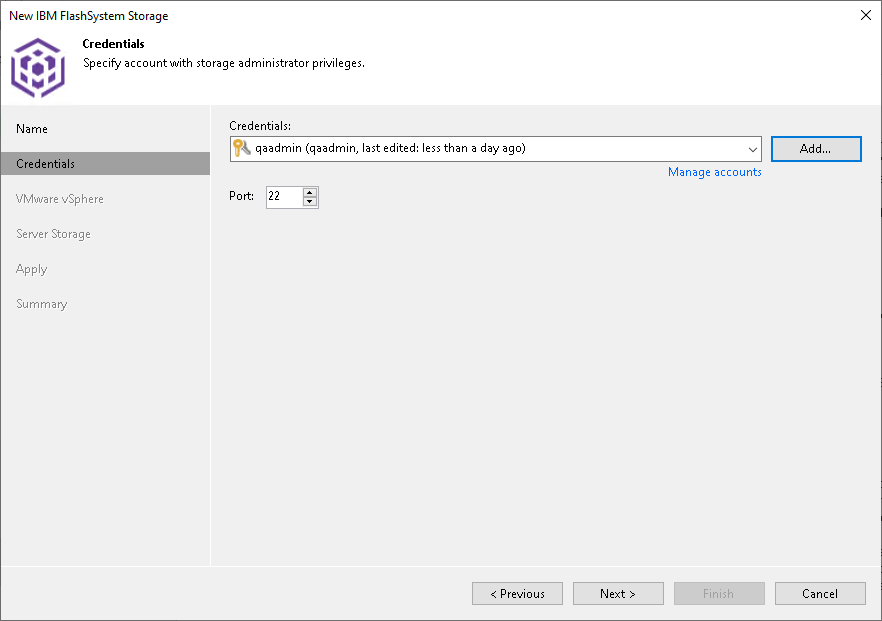

# Step 3. Specify Credentials

In this article

At the Credentials step of the wizard, specify credentials for a user account with administrator privileges on the storage system.

1. From the Credentials list, select credentials to connect to the storage system. If you have not set up credentials beforehand, click the Manage accounts link or click Add on the right of the Credentials field to add the credentials. For more information, see the [Credentials Manager](credentials_manager.md) section in the Veeam Backup & Replication User Guide.

|  |
| --- |
| Note |
| User name and password values are case-sensitive. |

1. In the Port field, specify a number of the port that you plan to use to connect to a server.

Page updated 4/17/2025

Page content applies to build 13.0.1.1071
