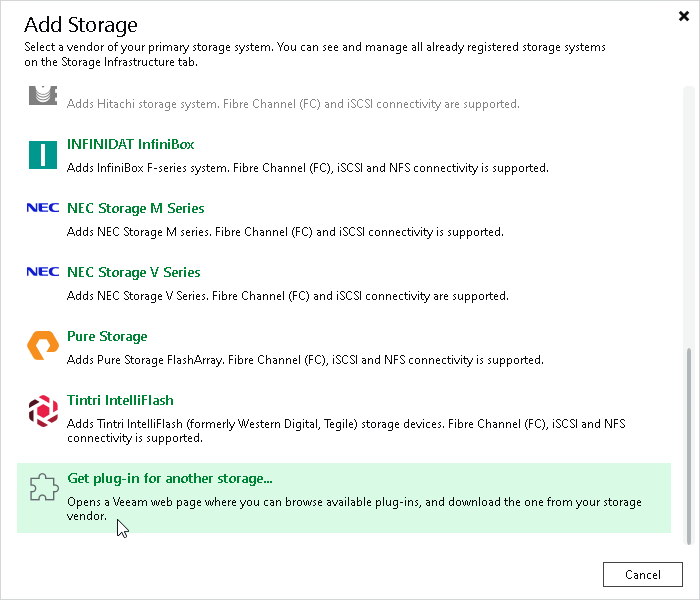

# Step 1. Launch Storage Installation Wizard

To launch a storage installation wizard for Universal Storage API integrated systems, perform the following steps.

1. Open the Storage Infrastructure view and do one of the following:

+ In the working area, click Add Storage.
+ In the inventory pane, right-click the Storage Infrastructure node and select Add Storage.

1. In the Add Storage window, select the storage system that you want to add.

If a storage system that you want to add is not shown in the list, click Get plug-in for another storage.

