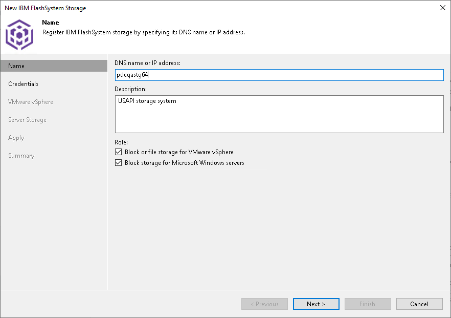

# Step 2. Specify Storage Name or Address and Storage Role

At the Name step of the wizard, specify the storage system name, description and storage role.

1. In the DNS Name or IP address field, specify a DNS name or IP address of the storage system.

For some storage systems, you can specify IPv6 addresses. For the list of supported systems, see [General Requirements and Limitations](storage_limitations_general.md#ipv6). Note that you can use IPv6 addresses only if IPv6 communication is enabled as described in the [IPv6 Support](ipv6.md) section in the Veeam Backup & Replication User Guide.

1. In the Description field, provide a description for future reference. The default description contains information about the user who added the storage system, date and time when the storage system was added.
2. In the Role section, select the types of backup jobs that are allowed to access this storage system:

1. Select the Block or file storage for VMware vSphere check box to allow VMware backup. For more information, see [VMware Integration (Storage Systems)](vmware_integration.md).
2. Select the Block storage for Microsoft Windows servers check box to allow backup of Veeam Agents. For more information, see [NAS Integration (Storage Systems)](nas_integration.md).
3. Select the Block storage for application protection check box to allow backup of InterSystems IRIS instances. For more information, see [Epic EHR System Protection Integration](storage_iris_integration.md).

When you select any of these check boxes, additional steps of the wizard will appear.

If you do not select any check box, Veeam Backup & Replication displays an error. To proceed with the wizard, select at least one check box.

Page updated 2026-07-28

