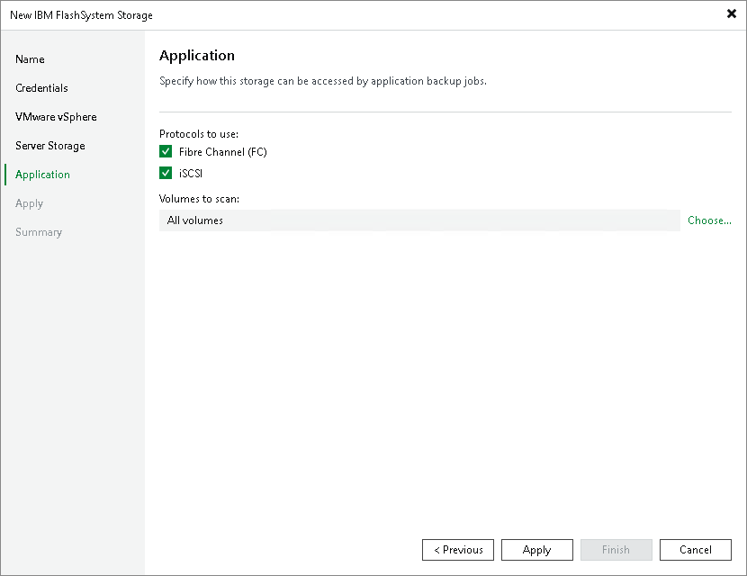

# Step 6. Specify IRIS Access Options

[This step is available if you have selected the Block storage for application protection check box at the [Specify Storage Name or Address and Storage Role](usais_add_name.md) step of the wizard.]

At the Application step of the wizard, specify options for accessing the storage system.

1. In the Protocol to use section, select check boxes next to protocols over which you want to work with the storage system.
2. If you plan to work with specific storage volumes, you can limit the storage rescan scope. In this case, Veeam Backup & Replication will rescan only the volumes that you select. Limiting the rescan scope reduces the amount of time required for the rescan operation.

To select volumes to rescan, click Choose to the right of the Volumes to scan field. In the Edit Volumes window, select volumes you want to rescan:

* To rescan all volumes in the storage hierarchy, leave All existing volumes option selected.
* To exclude volumes from rescan, select All volumes except and click Add. Click From infrastructure to select volumes from your storage infrastructure, or By wildcard to select volumes using a wildcard character.
* To rescan only specific volumes, select Only the following volumes and click Add. Click From infrastructure to select volumes from your storage infrastructure, or By wildcard to select volumes using a wildcard character.

After you finish working with the wizard, you can change the rescan scope and start the rescan process manually at any time. For more information, see [Rescanning Storage Systems](storage_rescan.md).

Page updated 2026-07-14

