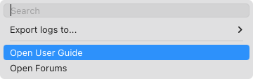

# Operations Available on Mac Computers

In this article

Mac computers are managed by Veeam Backup & Replication through a protection group for pre-installed Veeam Agents. You can protect Mac computers only by a backup job managed by Veeam Agent.

On the Veeam Agent computer side, you can perform the following operations:

* [View information about Veeam Agent](#va_info).
* [View backup job details](#job_settings).
* [Start backup job](#start_job).
* [Start active full backup](#start_af).
* [Stop backup job](#stop_job).
* [View session statistics](#job_stats).
* [Perform restore](#restore).
* [Manage operation mode](#manage_mode).
* [Export logs](#logs).
* [Get support](#support).

Viewing Information About Veeam Agent

You can view the following information about Veeam Agent in the command line interface:

* Veeam Agent version. To view the version of Veeam Agent, run the following command:

|  |
| --- |
| veeamconfig version |

* Veeam Agent license. To view information on the Veeam Agent license, run the following command:

|  |
| --- |
| veeamconfig license show |

* Veeam Agent operation mode. To view information on the Veeam Agent operation mode, run the following command:

|  |
| --- |
| veeamconfig mode info |

|  |
| --- |
| TIP |
| You can also change the operation mode of Veeam Agent. For more information, see [Manage Operation Mode](#manage_mode). |

Viewing Backup Job Details

You can view the settings of backup jobs managed by Veeam Agent. This process does not differ from the one for Veeam Agent operating in the standalone mode. For more information, see [Viewing Backup Job Settings](https://helpcenter.veeam.com/docs/agentformac/userguide/backup_job_info.html?ver=13) in the Veeam Agent for Mac User Guide.

Starting Backup Job

On the Veeam Agent computer side, you can start a backup job managed by Veeam Agent either from the Veeam Agent control panel or using the command line interface. This process does not differ from the one for Veeam Agent operating in the standalone mode. For more information, see [Starting Backup Job](https://helpcenter.veeam.com/docs/agentformac/userguide/backup_job_start_panel.html?ver=13) and [Starting Backup Job in CLI](https://helpcenter.veeam.com/docs/agentformac/userguide/backup_job_start_cmd.html?ver=13) in the Veeam Agent for Mac User Guide.

Starting Active Full Backup

On the Veeam Agent computer side, you can create ad-hoc active full backups. You can start a backup job that will create an active full backup either from the Veeam Agent control panel or using the command line interface. The procedure of creating an active full backup does not differ from the same procedure for Veeam Agent operating in the standalone mode. For more information, see [Creating Active Full Backup](https://helpcenter.veeam.com/docs/agentformac/userguide/backup_active_full_gui.html?ver=13) and [Creating Active Full Backup in CLI](https://helpcenter.veeam.com/docs/agentformac/userguide/backup_active_full.html?ver=13) in the Veeam Agent for Mac User Guide.

Stopping Backup Job

On the Veeam Agent computer side, you can stop any running backup job from the Veeam Agent control panel or using the command line interface. This process does not differ from the one for Veeam Agent operating in the standalone mode. For more information, see [Stopping Backup Job](https://helpcenter.veeam.com/docs/agentformac/userguide/backup_job_stop_panel.html?ver=13) and [Stopping Backup Job in CLI](https://helpcenter.veeam.com/docs/agentformac/userguide/backup_job_stop_cmd.html?ver=13) in the Veeam Agent for Mac User Guide.

Viewing Session Progress, Statistics and Results

On the Veeam Agent computer side, you can view the statistics of the completed backup job and restore sessions from the Veeam Agent control panel or using the command line interface. You can also view the progress and statistics of a running session in real-time. The options of viewing session statistics do not differ from the same options for Veeam Agent operating in the standalone mode. For more information, see the [Reporting](https://helpcenter.veeam.com/docs/agentformac/userguide/reporting.html?ver=13) section in the Veeam Agent for Mac User Guide.

Performing Restore

The restore options for Veeam Agent operating in the managed mode do not differ from the same options for Veeam Agent operating in the standalone mode. You can perform restore in the following ways:

* You can restore user profile data. For more information, see the [Restoring User Data](https://helpcenter.veeam.com/docs/agentformac/userguide/users_restore.html?ver=13) section in the Veeam Agent for Mac User Guide.
* You can restore individual files and folders. For more information, see the [Restoring Files and Folders](https://helpcenter.veeam.com/docs/agentformac/userguide/files_restore.html?ver=13) section in the Veeam Agent for Mac User Guide.
* You can perform restore from an encrypted backup. For more information, see the [Restoring Data from Encrypted Backups](https://helpcenter.veeam.com/docs/agentformac/userguide/restore_encrypted.html?ver=13) section in the Veeam Agent for Mac User Guide.

Managing Operation Mode

You can manage the operation mode of Veeam Agent. This process does not differ from the one for Veeam Agent operating in the standalone mode. For more information, see [Managing Veeam Agent Operation Mode](https://helpcenter.veeam.com/docs/agentformac/userguide/installation_operation_mode.html?ver=13) in the Veeam Agent for Mac User Guide.

Exporting Logs

This operation may be required if you want to report an issue and need to attach log files to the support case. The procedure of exporting product logs does not differ from the one for Veeam Agent operating in the standalone mode. For more information, see the [Exporting Product Logs](https://helpcenter.veeam.com/docs/agentformac/userguide/logs_export.html?ver=13) section in the Veeam Agent for Mac User Guide.

Getting Support

If you have any questions or want to share your feedback about Veeam Agent, you can use one of the following options:

* Contact your Veeam backup administrator.
* Search for the information on the necessary subject in the current [Veeam Agent for Mac User Guide](https://helpcenter.veeam.com/docs/agentformac/userguide/overview.html?ver=13).

* Visit [Veeam R&D Forums](https://forums.veeam.com) and share your opinion or ask a question.

To access help and support options in Veeam Agent:

1. In the Veeam Agent application menu, select Help.
2. In the Help menu, select one of available options to get support on the product:

* Open User Guide
* Open Forums

Page updated 11/17/2025

Page content applies to build 13.0.1.1071
