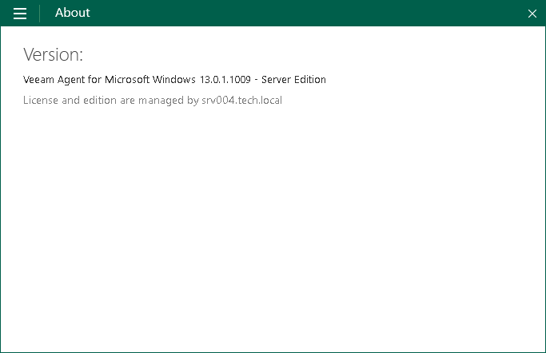
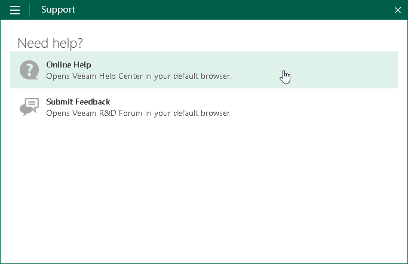

# Operations Available on Windows Computers

The list of operations that you can perform on a Windows-based Veeam Agent computer managed by Veeam Backup & Replication depends on the backup job type:

* If a Veeam Agent computer is protected by a backup job managed by the backup server, on the Veeam Agent computer side you can perform restore from Veeam Recovery Media. To learn more, see the [Restoring from Veeam Recovery Media](https://helpcenter.veeam.com/docs/agentforwindows/userguide/image_boot.html?ver=13) section in the Veeam Agent for Microsoft Windows User Guide.

|  |
| --- |
| NOTE |
| Make sure that Veeam Recovery Media was created beforehand and you can access it. For a Veeam Agent computer protected by a backup job managed by the backup server, you can create Veeam Recovery Media from the Veeam Backup & Replication console. To learn more, see [Creating Veeam Recovery Media](recovery_media_create.md). |

* If a Veeam Agent computer is protected by a backup job managed by Veeam Agent, on the Veeam Agent computer side you can perform the following operations:

* [View information about Veeam Agent](#agent).
* [Create Veeam Recovery Media](#media).
* [Perform incremental backup](#backup).
* [Stop backup job](#stop).
* [Perform restore](#restore).
* [View session statistics](#info).
* [Get support](#support).

Viewing Information About Veeam Agent

You can view the Veeam Agent version, product edition and information about the backup server that manages the Veeam Agent computer:

1. Double-click the Veeam Agent icon in the system tray, or right-click the Veeam Agent icon in the system tray and select Control Panel.

If you do not see the Veeam Agent icon in the system tray, run Veeam Agent for Microsoft Windows from the Microsoft Windows Start menu.

1. Open the About tab.

|  |
| --- |
| TIP |
| You can update the license and product edition from the Veeam Backup & Replication console. For more information, see [Updating License](license_update.md). |

Creating Veeam Recovery Media

The procedure of creating Veeam Recovery Media for Veeam Agent operating in the managed mode does not differ from the same procedure for Veeam Agent operating in the standalone mode. You can create Veeam Recovery Media in the following ways:

* With the Create Recovery Media wizard. For more information, see the [Creating Veeam Recovery Media](https://helpcenter.veeam.com/docs/agentforwindows/userguide/image_create.html?ver=13) section in the Veeam Agent for Microsoft Windows User Guide.
* Using the command line interface. For more information, see the [Creating Veeam Recovery Media with Command Line Interface](https://helpcenter.veeam.com/docs/agentforwindows/userguide/image_create_cmd.html?ver=13) section in the Veeam Agent for Microsoft Windows User Guide.

Performing Incremental Backup

The procedure of creating ad-hoc incremental backup for Veeam Agent operating in the managed mode does not differ from the same procedure for Veeam Agent operating in the standalone mode. You can create ad-hoc incremental backup in the following ways:

* From the Veeam Agent control panel. For more information, see the [Creating Incremental Backups](https://helpcenter.veeam.com/docs/agentforwindows/userguide/backup_incremental.html?ver=13) section in the Veeam Agent for Microsoft Windows User Guide.
* Using the command line interface. For more information, see the [Creating Backups](https://helpcenter.veeam.com/docs/agentforwindows/userguide/backup_cmd.html?ver=13#creating-backups) section in the Veeam Agent for Microsoft Windows User Guide.

Stopping Backup Job

You can stop any running backup job from the Veeam Agent control panel. This process does not differ from the one for Veeam Agent operating in the standalone mode. For more information, see the [Stopping Backup Job](https://helpcenter.veeam.com/docs/agentforwindows/userguide/backup_job_stop.html?ver=13) section in the Veeam Agent for Microsoft Windows User Guide.

Performing Restore

If you experience a problem with your computer, your data gets lost or corrupted, you can recover your data or bring the computer back to work. The restore options for Veeam Agent operating in the managed mode does not differ from the same options for Veeam Agent operating in the standalone mode. You can perform restore in the following ways:

* You can perform restore from Veeam Recovery Media. For more information, see the [Restoring from Veeam Recovery Media](https://helpcenter.veeam.com/docs/agentforwindows/userguide/image_boot.html?ver=13) section in the Veeam Agent for Microsoft Windows User Guide.
* You can perform restore using Veeam Agent and Microsoft Windows Tools. For more information, see the [Using Veeam Agent and Microsoft Windows Tools](https://helpcenter.veeam.com/docs/agentforwindows/userguide/image_boot_endpoint.html?ver=13) section in the Veeam Agent for Microsoft Windows User Guide.
* You can perform restore using Microsoft Windows Recovery Environment. For more information, see the [Using Microsoft Windows Recovery Environment](https://helpcenter.veeam.com/docs/agentforwindows/userguide/image_boot_windows.html?ver=13) section in the Veeam Agent for Microsoft Windows User Guide.
* You can restore volumes. For more information, see the [Restoring Volumes](https://helpcenter.veeam.com/docs/agentforwindows/userguide/volume_restore.html?ver=13) section in the Veeam Agent for Microsoft Windows User Guide.
* You can restore individual files and folders. For more information, see the [Restoring Files and Folders](https://helpcenter.veeam.com/docs/agentforwindows/userguide/files_restore.html?ver=13) in the Veeam Agent for Microsoft Windows User Guide.
* You can perform restore from an encrypted backup. For more information, see the [Restoring Data from Encrypted Backups](https://helpcenter.veeam.com/docs/agentforwindows/userguide/restore_encrypted.html?ver=13) section in the Veeam Agent for Microsoft Windows User Guide.

|  |
| --- |
| NOTE |
| By default, restore from the Veeam Agent computer side is available only for user accounts with Local Administrator permissions.  If you want to perform restore under accounts that do not have administrative privileges, make sure that the Allow file level recovery without administrative account check box in the Veeam Agent for Microsoft Windows settings is selected before you start the restore process. To learn more, see [Veeam Agent for Microsoft Windows Settings](agents_protection_group_advanced_vaw.md). |

Viewing Session Progress, Statistics and Results

You can get information about backup and restore sessions. Available options do not differ from those for Veeam Agent operating in the standalone mode:

* You can view statistics of the completed sessions in the Veeam Agent control panel. For more information, see the [Viewing Statistics in Control Panel](https://helpcenter.veeam.com/docs/agentforwindows/userguide/reporting_control_panel.html?ver=13) section in the Veeam Agent for Microsoft Windows User Guide.
* You can get information about the backup state using the Veeam Agent for Microsoft Windows tray agent. For more information, see the [Monitoring Backup State with Tray Agent](https://helpcenter.veeam.com/docs/agentforwindows/userguide/reporting_tray.html?ver=13) section in the Veeam Agent for Microsoft Windows User Guide.
* You can get information about the backup progress using the Veeam Agent for Microsoft Windows taskbar button. For more information, see the [Monitoring Backup Process in Taskbar Button](https://helpcenter.veeam.com/docs/agentforwindows/userguide/reporting_taskbar.html?ver=13) section in the Veeam Agent for Microsoft Windows User Guide.

Getting Support

If you have any questions or want to share your feedback about Veeam Agent, you can use one of the following options:

* Contact your Veeam backup administrator.
* Search for the information on the necessary subject in the current [Veeam Agent for Microsoft Windows User Guide](https://helpcenter.veeam.com/docs/agentforwindows/userguide/overview.html?ver=13).

* Visit [Veeam R&D Forums](https://forums.veeam.com) and share your opinion or ask a question.

To access help and support options in Veeam Agent:

1. Right-click the Veeam Agent for Microsoft Windows icon in the system tray and select Control Panel.
2. From the main menu, select Support.
3. Click one of available options to get support on the product.

