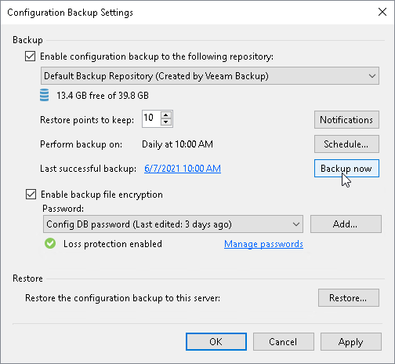
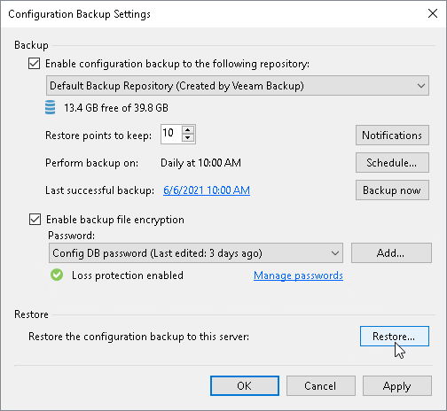
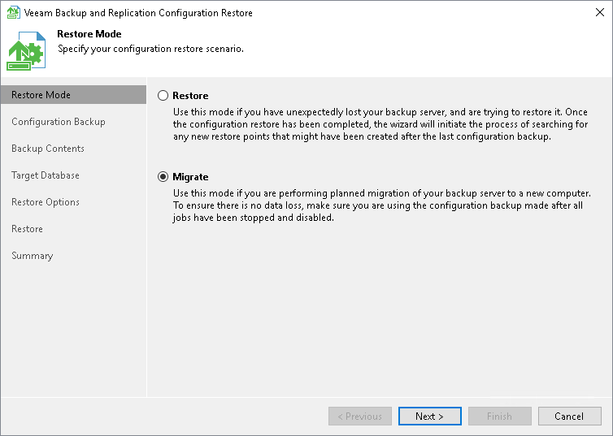

# Migrating Configuration Database to PostgreSQL Server

If you need to migrate the Veeam Backup & Replication configuration database from Microsoft SQL Server to PostgreSQL, you need to create a new configuration backup and restore it on the PostgreSQL instance. As a result, you will be able to continue using the same Veeam Backup & Replication server but it will be connected to a configuration database on PostgreSQL instead of Microsoft SQL Server.

Limitations and Considerations

Before you migrate the configuration database of Veeam Backup & Replication to PostgreSQL, consider the following limitations and considerations:

* This section gives instructions on how to migrate a configuration database to PostgreSQL. If you need to migrate the Veeam Backup & Replication application itself, see [Migrating Veeam Backup & Replication to Another Backup Server](vbr_config_migrate.md).
* If you want to migrate configuration database from PostgreSQL to another SQL server, see [Migrating Configuration Database to Another SQL Server](vbr_config_migrate_to_another_server.md).
* It is recommended that you use Veeam Backup & Replication tools to create configuration backups and migrate the configuration database.
* If a backup server and a configuration database are located in different AD domains, the AD domain where the configuration database is located must have a trust relationship with the AD domain to which the backup server is added.

* Veeam Backup & Replication supports configuration database migration between different database engines only within the same Veeam Backup & Replication version.

* Veeam Backup Enterprise Manager collects data from backup servers with configuration databases that run on the same database engine as the Enterprise Manager configuration database. The database engine used by Veeam Backup Enterprise Manager and all of the Veeam Backup & Replication Servers managed by this Veeam Backup Enterprise Manager must match. To migrate the Enterprise Manager configuration database, see [Veeam Backup Enterprise Manager Guide](https://helpcenter.veeam.com/docs/vbr/em/em_db_migration.html?ver=13).

* PostgreSQL standard system database named template1 must have UTF-8 encoding.

Migrating Configuration Database

If you want to migrate the configuration database of Veeam Backup & Replication to another PostgreSQL, perform the following steps:

1. [Stop and disable jobs](#step1).
2. [Back up the configuration database](#step2).
3. [Restore the configuration database from the backup](#step4).
4. [[Optional] Reactivate the Enterprise Manager Keyset](#step5).
5. [Finish the configuration](#step6).

Step 1. Stop and Disable Jobs

Before you start the database migration, you must finish all jobs and restore sessions. If the job is scheduled, you must disable the job. For instructions on how to stop and disable jobs, see [Managing Backup Jobs](managing_jobs.md).

|  |
| --- |
| Note |
| Do not start or enable any jobs until the migration of Veeam Backup & Replication is finished. If you start a job before migration is completed, Veeam Backup & Replication will produce a new restore point in the chain and update the chain metadata. The created configuration backup will not contain information about this new restore point. When you migrate data from the configuration backup to the database and start the job again, Veeam Backup & Replication will fail to synchronize the metadata of the backup chain with data in the database. As a result, the job will fail. |

Step 2. Create Configuration Database Backup

To create a configuration database backup manually, perform the following steps:

1. From the main menu of the Veeam Backup & Replication console, select Configuration Backup.
2. Make sure that the Enable configuration backup to the following repository check box is selected.
3. From the list of repositories, select a backup repository in which the configuration backup must be stored.
4. Click Backup now.

|  |
| --- |
| Note |
| Loss protection disabled warning is safe to ignore if you do not have Veeam Backup Enterprise Manager installed, your backup server is not registered with Veeam Backup Enterprise Manager server, or your system administrator chose not to enable loss protection functionality. |

Step 3. Restore Configuration Database from Backup

Before you start the restore process, check the [prerequisites](restore_vbr_before_you_begin.md). To restore the configuration database, perform the following:

1. From the main menu of the Veeam Backup & Replication console, select Configuration Backup.
2. In the Restore section, click Restore.

1. At the Restore Mode step of the Veeam Backup & Replication Configuration Restore wizard, select Migrate.

1. Complete the wizard as described in section [Restoring Configuration Database](restore_vbr_source.md). On the Target Database tab of the configuration restore wizard, select PostgreSQL as the database engine.

|  |
| --- |
| Important |
| After the restore process, make sure that PostgreSQL target instance is configured according to the recommended hardware resources values. You can modify settings of PostgreSQL target instance using the Set-VBRPSQLDatabaseServerLimits cmdlet. For more information, see [Veeam PowerShell Reference](https://helpcenter.veeam.com/docs/vbr/powershell/set-vbrpsqldatabaseserverlimits.html?ver=13). |

|  |
| --- |
| Note |
| After you complete the restore process, Veeam Backup & Replication will connect to the database you specified as a target. |

Step 4. [Optional] Reactivate Enterprise Manager Keyset

After you migrate the Veeam Backup & Replication configuration database to another server, Veeam Backup Enterprise Manager still sees the Veeam Backup & Replication server. However, you may need to reactivate encryption keys.

If you use the [Data Encryption](data_encryption.md) feature to encrypt backups and your Veeam Backup & Replication server is added to the Veeam Backup Enterprise Manager infrastructure, then you must reactivate the Enterprise Manager keyset.

To reactivate the Enterprise Manager key, perform the following steps:

1. In the Veeam Backup Enterprise Manager web console, open the Settings section of the Configuration view.
2. Open the Key Management tab.
3. In the Managed keys section, select the necessary keyset and click Activate.

For detailed instructions, see the [Activating Enterprise Manager Keyset](https://helpcenter.veeam.com/docs/vbr/em/em_activate_em_keys.html?ver=13 ) section in the Veeam Backup Enterprise Manager Guide.

Step 5. Finish Configuration

After restoring the configuration database from the backup, finalize the configuration:

* Configure all necessary settings to ensure that you have a working configuration database backup. You can now perform a backup of your new configuration database in the Configuration Backup Settings window.

Reschedule your configuration database backup. Also, check if you can see the Loss protection enabled label.

* If you have local repositories, after migration to another VM they may be displayed as empty. In this case, add them again and remap the jobs.

* Enable your backup jobs and backup copy jobs. Take a closer look at your backup infrastructure to ensure that everything is working as expected.

