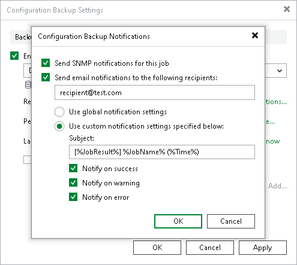

# Configuring Notification Settings for Configuration Backups

You can configure notifications for the configuration backup:

1. From the main menu, select Configuration Backup.
2. Click Notifications.
3. Select the Send SNMP notifications for this job check box if you want to receive SNMP traps when the job completes successfully.

SNMP traps will be sent if you specify global SNMP settings in Veeam Backup & Replication and configure software on recipient's machine to receive SNMP traps. For more information, see [Specifying SNMP Settings](snmp_settings.md).

1. Select the Send email notifications to the following recipients check box if you want to receive notifications about the job completion status by email. In the field under the check box, specify the recipient email address. You can enter several addresses separated by a semicolon.

Email notifications will be sent if you configure global email notification settings in Veeam Backup & Replication. For more information, see [Configuring Global Email Notification Settings](general_email_notifications.md).

1. You can choose to use global notification settings or specify custom notification settings.

+ To receive a typical notification for the job, select Use global notification settings. In this case, Veeam Backup & Replication will apply to the job global email notification settings specified for the backup server. For more information, see [Configuring Global Email Notification Settings](general_email_notifications.md).
+ To configure a custom notification for the job, select Use custom notification settings specified below check box. You can specify the following notification settings:

1. In the Subject field, specify a notification subject. You can use the following variables in the subject: %JobResult%, %JobName%, %Time% (completion time).

1. Select the Notify on success, Notify on warning and Notify on error check boxes to receive email notification if the job completes successfully, fails or completes with a warning.

