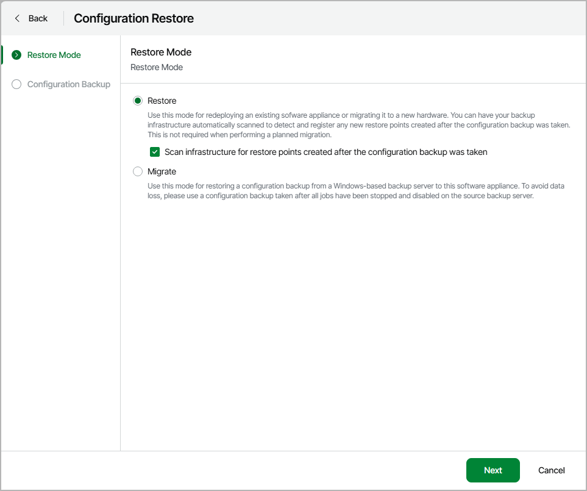
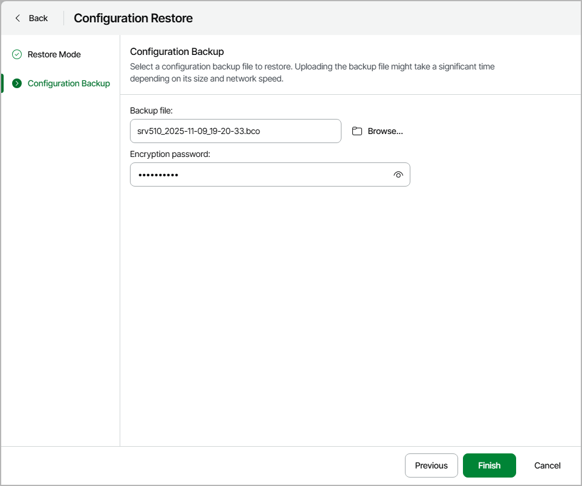

# Restoring Configuration Database using Veeam Host Management

In this article

Before you start the restore process, [check prerequisites](#5). Then perform the following steps:

1. [Launch Configuration Database Restore Wizard](#step1).
2. [Select Restore Mode](#step2).
3. [Select Configuration Backup](#step3).

Limitations and Considerations

Before you restore the configuration database of Veeam Backup & Replication, consider the following limitations and considerations:

* On the backup server running Veeam Backup & Replication 13, you can only restore configuration backups created with Veeam Backup & Replication 13.

* Unencrypted configuration backup files are not supported.

* Make sure that the certificate chain restored from a configuration backup will successfully pass validation on the target backup server. This precaution is required if the following conditions are met:

1. You want to restore configuration database of a backup server used in the Veeam Agent management scenario.
2. The backup server whose configuration database you want to restore uses a custom certificate issued by a Certificate Authority instead of the default self-signed certificate to ensure a secure connection in the Veeam Agent management infrastructure.

* After you run configuration restore for [capacity tier](capacity_tier.md), Veeam Backup & Replication will put the capacity tier extents into the [Sealed mode](sobr_seal.md). Rescan the backup infrastructure and then remove the extents from the Sealed mode.

* If you use Veeam Plug-Ins ([Veeam Plug-In for Nutanix AHV](https://helpcenter.veeam.com/docs/vbahv/userguide/overview.html?ver=9) and so on) and want to restore the configuration database to a new machine, make sure you have the plug-ins installed before the restoration process.

* To restore the configuration database from the backup server with the configured Security Officer account to another backup server, consider the following:

+ The target backup server must also have the configured Security Officer account.
+ In the Veeam Host Management console of the target backup server, a Security Officer must specify a configuration backup passphrase used to encrypt the configuration backup on the previous backup server. For more information, see [Managing Configuration Backup Passphrases](hmc_perform_so_tasks.md#manage_bco_passphrase).

Step 1. Launch Configuration Database Restore Wizard

To launch the configuration database restore wizard:

1. Log in to the Veeam Host Management web UI.
2. In the management pane, click Backup Infrastructure.
3. In the Configuration Restore section, click Submit Request to acquire permissions:

* If you did not configure the Security Officer account during the Veeam appliance installation, restore will be enabled immediately.
* If you configured the Security Officer account, restore will be enabled after the Security Officer approves the request.

1. In the Configuration Restore section, click Start configuration restore.

Step 2. Select Restore Mode

At the Restore Mode step of the wizard, do the following:

1. In the mode selection, select Restore.
2. Select the Scan infrastructure for restore points created after the configuration backup was taken check box.

In the Restore mode, Veeam Backup & Replication retrieves configuration data from the backup and stores it to the target database. After that, Veeam Backup & Replication performs additional rescan of VM replicas and backup repositories connected to the backup server, and runs tape library cataloging process. Rescan helps synchronize potential changes between the backup infrastructure and restored database that took place from the moment when the configuration backup was created till the present time. As a result, the target configuration database will contain information about restore points that were created after the configuration backup was taken, and this information is displayed in the Veeam Backup & Replication console.

Step 3. Select Configuration Backup

At the Configuration Backup step of the wizard, do the following:

1. Click Browse to select a configuration backup file.
2. Specify the backup encryption password.
3. Click Finish.

Veeam Backup & Replication will use the specified backup file file to perform the restore of configuration database.

Page updated 12/22/2025

Page content applies to build 13.0.1.1071
