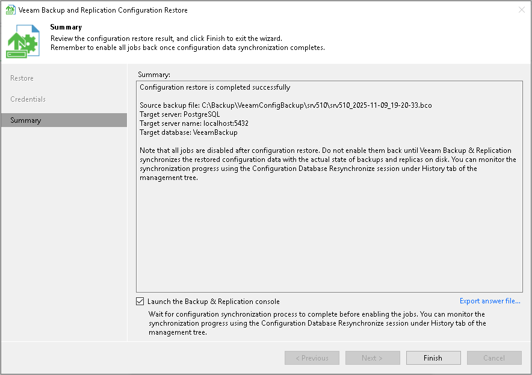

# Step 12. Finish Working with Wizard

In this article

At the Summary step of the wizard, finalize the process of configuration data restore.

1. Review the restore process results.
2. If you want to start Veeam Backup & Replication after you finish working with the wizard, select the Launch the Backup & Replication user interface check box.
3. If you want to export the configuration file, click Export answer file.
4. Click Finish to exit the wizard.

|  |
| --- |
| Note |
| Consider the following:   * If you created custom registry values or changed the existing ones on the backup server, you must recreate or change the registry values again. * If you restore data from the configuration backup in the Restore mode, all jobs on the backup server will be disabled after the restore process is complete. You need to enable them manually. |

Page updated 11/9/2025

Page content applies to build 13.0.1.1071
