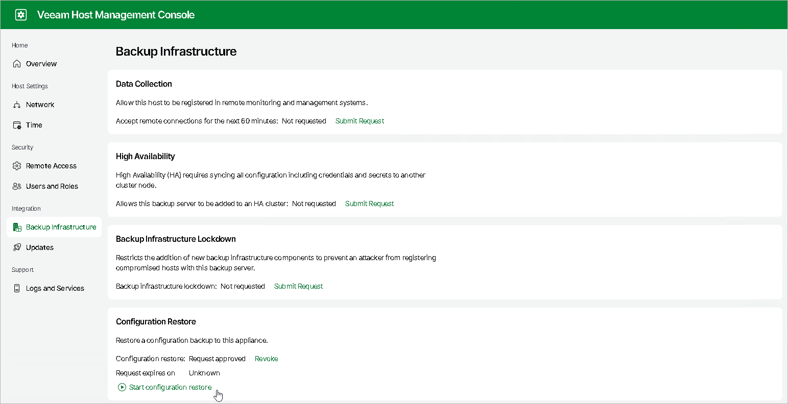
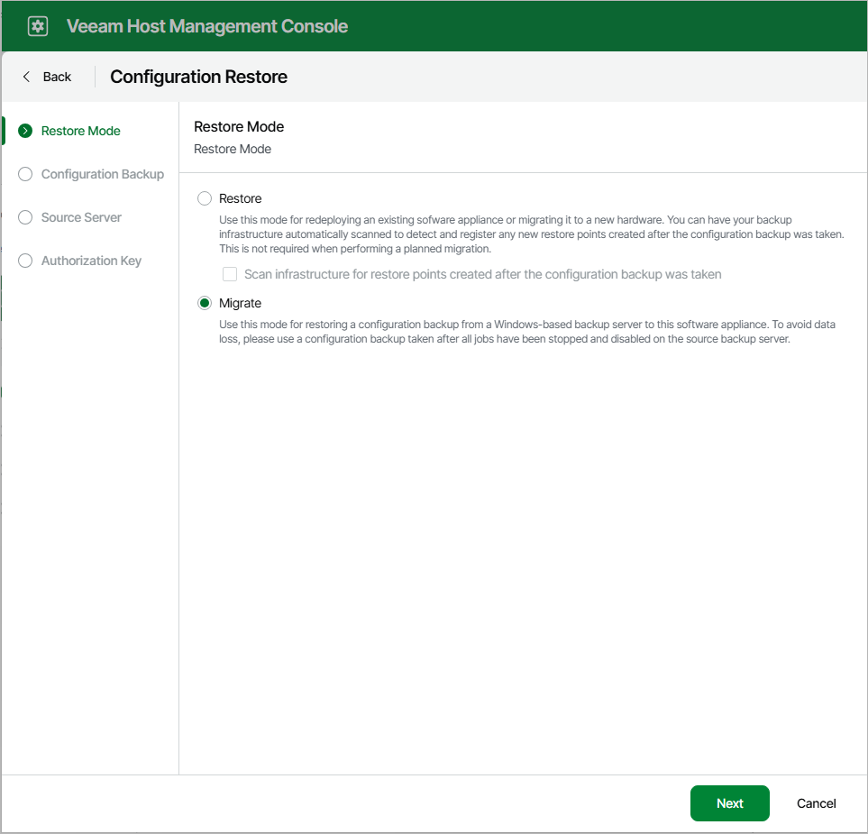
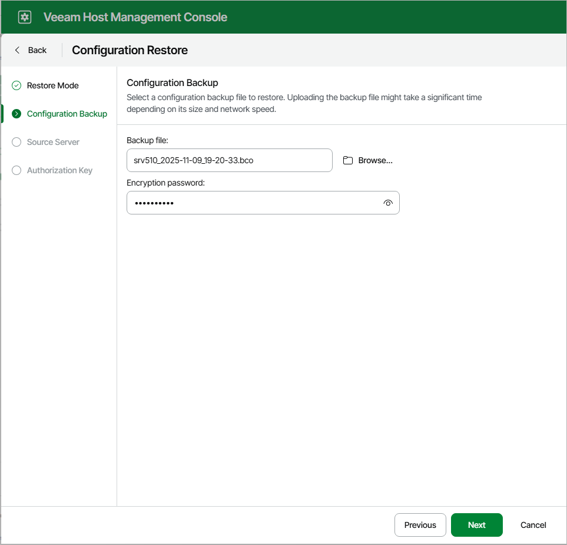
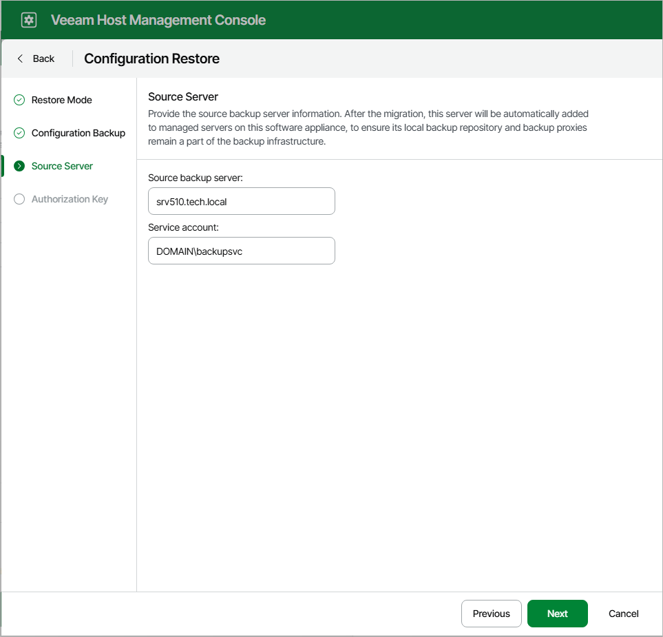
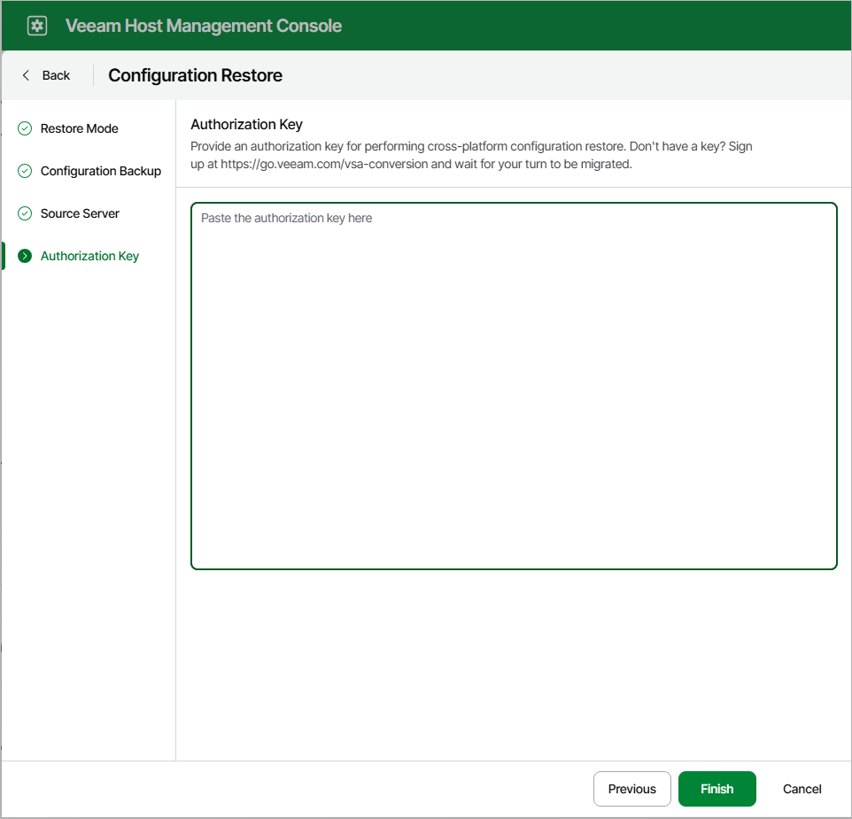

# Migrating Veeam Backup & Replication to Linux-Based Backup Server

In this article

If you need to migrate Veeam Backup & Replication from Windows-based backup server to Linux-based backup server, you can back up its configuration database, install Veeam Backup & Replication on the target server and restore the configuration data from the backup. As a result, you will have new Veeam Backup & Replication server with settings, jobs and backup infrastructure from the old server.

|  |
| --- |
| Important |
| This feature is available only in queue mode. To join the queue, please sign up [here](https://go.veeam.com/vsa-conversion).  Registration is required because the migration process is complex and platform conversion requires professional assistance. The queue works on a first-come, first-served basis to ensure that all requests are handled efficiently and with the best possible customer experience. |

Before you begin

Before you migrate the Veeam Backup & Replication configuration database to Linux-based backup server, check the following prerequisites:

* Install Veeam Backup & Replication on the Linux machine where you plan to move your source backup server. The machine must meet [system requirements for a backup server](system_requirements.md#backup_server_linux). For instructions on how to install Veeam Backup & Replication, see [Deployment](deployment.md).
* Stop all running jobs and disable all scheduled jobs on the source backup server before you create the configuration backup. Do not start or enable any jobs until the migration of Veeam Backup & Replication is finished. If you start a job before migration is completed, Veeam Backup & Replication will produce a new restore point in the chain and update the chain metadata. The created configuration backup will not contain information about this new restore point. When you migrate data from the configuration backup to the database and start the job again, Veeam Backup & Replication will fail to synchronize the chain metadata with data in the database. As a result, the job will fail.
* Manually create an encrypted configuration backup of the source Veeam Backup & Replication database as described in the [Running Configuration Backups Manually](vbr_config_manually.md) section. Unencrypted configuration backup files are not supported.

Migrating Veeam Backup & Replication

Perform the following steps:

Step 1. Launch Configuration Restore Wizard

1. Log in to the Veeam Host Management web UI.

In the browser address bar, enter the following URL, replacing <VBR-Host-IP> with the hostname or IP address of your target Veeam Backup & Replication server:

|  |
| --- |
| https://<VBR-Host-IP>:10443/ |

1. In the Configuration Restore section, click Submit Request to acquire permissions:

* If you did not configure the Security Officer account during the Veeam appliance installation, restore will be enabled immediately.
* If you configured the Security Officer account, restore will be enabled after the Security Officer approves the request.

1. In the Configuration Restore section, click Start configuration restore.

Step 2. Select Restore Mode

At the Restore Mode step of the wizard, select Migrate.

Step 3. Select Configuration Backup

At the Configuration Backup step of the wizard, click Browse to select a configuration backup file to restore and specify the backup encryption password.

Step 4. Specify Source Backup Server

At the Source Server step of the wizard, specify the source backup server and service account.

After the migration, this server will be added to managed servers on the target software appliance. This ensures that its local backup repository and backup proxies remain a part of the backup infrastructure.

Step 5. Specify the Authorization Key

At the Authorization Key step of the wizard, specify the authorization key you received from the Veeam Support.

Step 6. Finish The Migration

After you migrate the configuration backup, finalize the configuration:

* If you created custom registry values or changed the existing ones on the previous backup server, you must recreate or change the registry values again manually on the target backup server. You can import saved keys using the reg import command or Registry Editor.
* If you have local repositories, after migration to another machine they may be displayed as empty. In this case, add them again and remap the jobs.
* If you use custom guest processing scripts, manually copy them to the new backup server.
* Enable your backup jobs and backup copy jobs. Take a closer look at your backup infrastructure to ensure that everything is working as expected.
* If you use Veeam Backup & Replication to back up storage systems, after migration they will not be added to the backup infrastructure. In this case, you must re-add them after migration completes. For more information, see [Storage System Snapshot Integration](storage_integration.md).
* If you use a hardened repository with immutability, after migration this server will not be available. In this case, you must specify single-use credentials for this repository again. For more information, see [Editing Settings of Backup Repositories](backup_repo_edit.md).
* If you use Linux hosts in your backup infrastructure, after migration these hosts and hosts that are associated with them will not be available. (For example, if you have a Linux host with the backup proxy role, the backup repositories to which this Linux-based backup proxy transfer during a backup job will not be available). In this case, you must [open the Edit Linux Server wizard](edit_server.md) for the necessary Linux host, follow the steps of the wizard and click Finish.
* If you have Veeam Agent backup jobs managed by Veeam Agents, update the backup policies after the migration process.
* You can safely uninstall Veeam Backup & Replication from the old backup server after migration.
* [For VMware vSphere] If you use CDP, after the migration the I/O filter will be owned by the previous backup server. You must take ownership of the I/O filter on the new backup server. For more information, see [Taking I/O Filter Ownership](cdp_io_filter_ownership.md).

|  |
| --- |
| Note |
| If the Veeam Backup & Replication server was added to the Veeam Backup Enterprise Manager or Veeam ONE infrastructure, you must add the new backup server and delete the old one after the migration. |

Page updated 11/19/2025

Page content applies to build 13.0.1.1071
