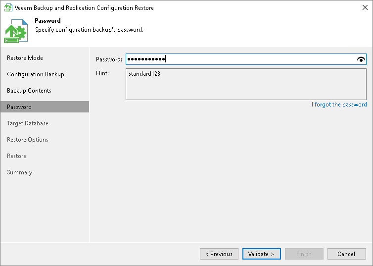

# Step 5. Specify Password

In this article

The Password step of the wizard is available if you have enabled the encryption option in the configuration backup properties.

Enter the password to decrypt configuration backup data:

1. Check the password hint to recall the password.
2. In the Password field, enter the password to decrypt the configuration backup file.

If you forgot or lost the password, click the I forgot the password link. For more information, see [Decrypting Data Without Password](decrypt_without_pass.md).

|  |
| --- |
| Note |
| Restoring configuration data without a password is included in the Veeam Universal License. When using a legacy socket-based license, Enterprise or higher edition is required.  Also, your backup server must be connected to Veeam Backup Enterprise Manager. Otherwise, you will not see the I forgot the password link. |

Page updated 12/4/2023

Page content applies to build 13.0.1.1071
