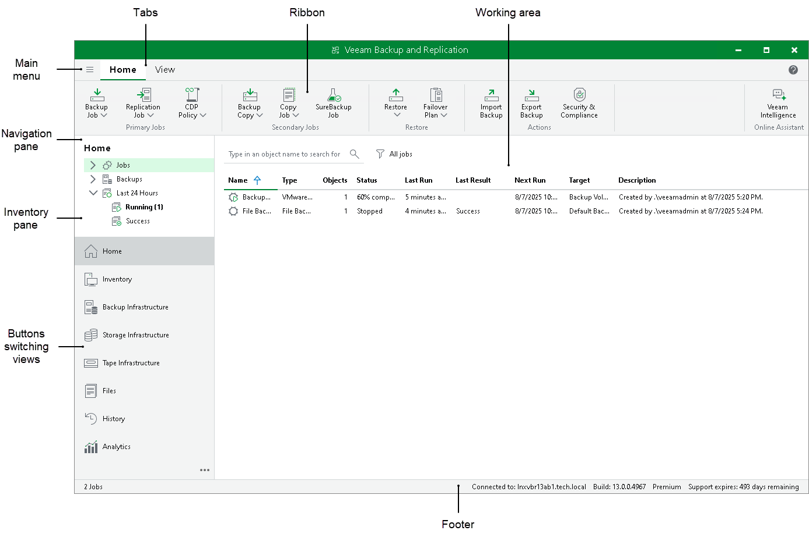
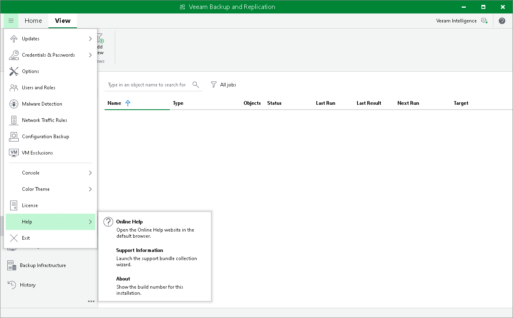
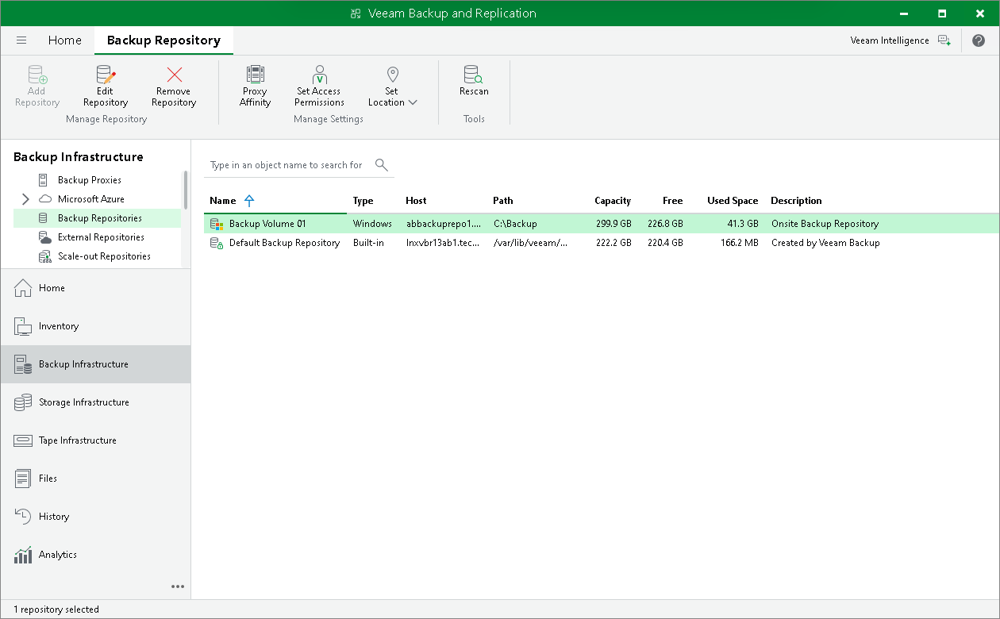
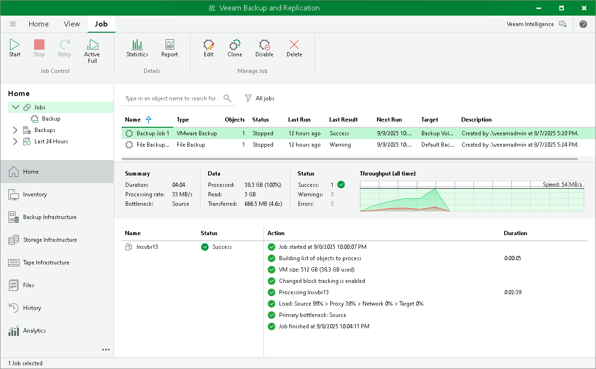
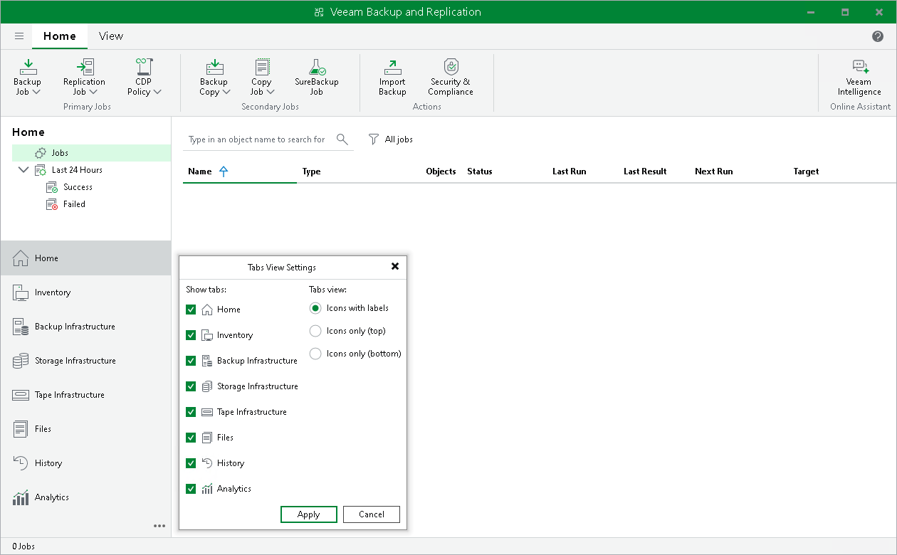
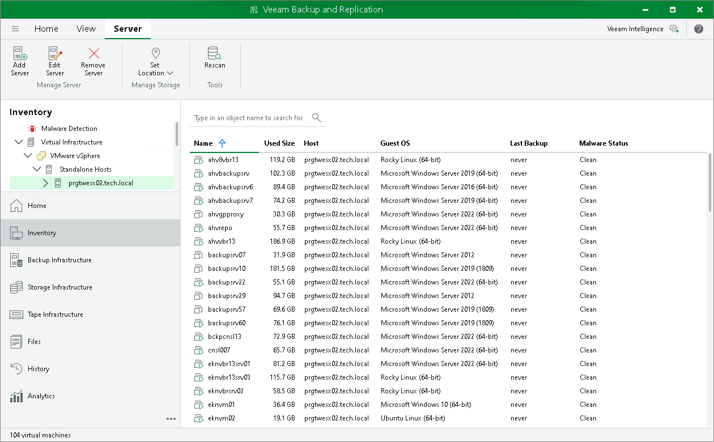
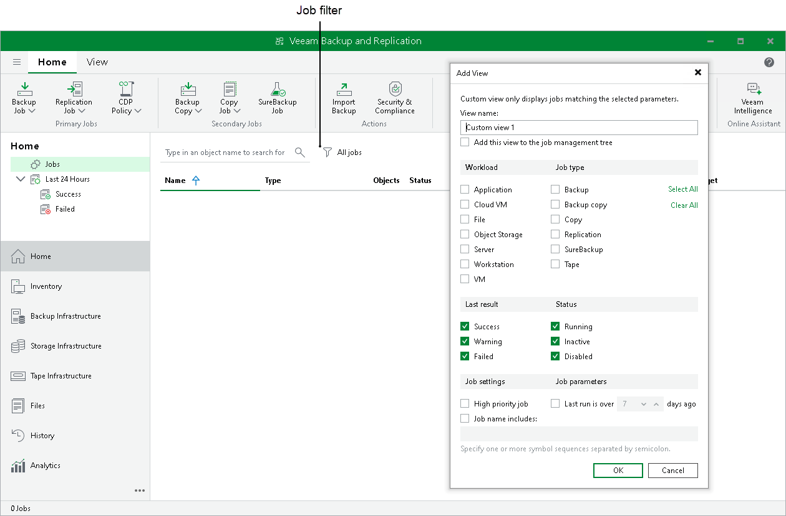
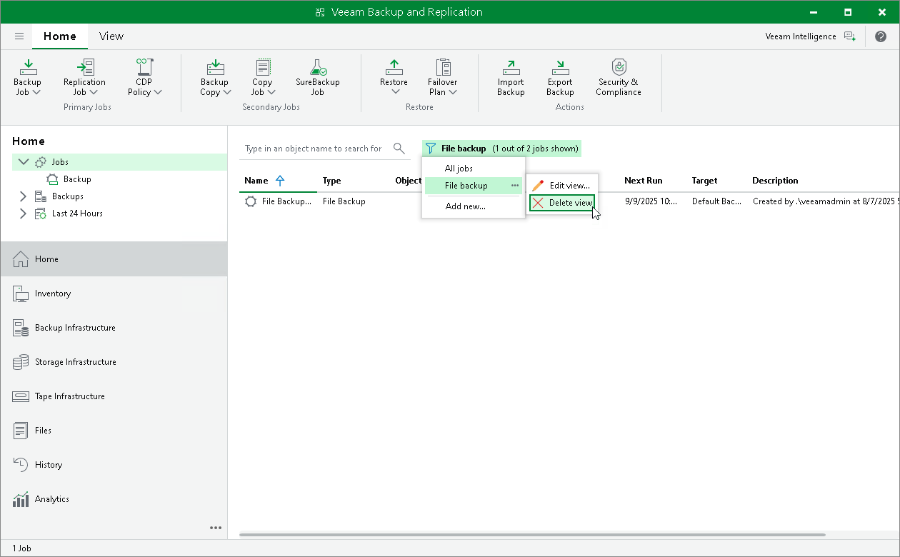
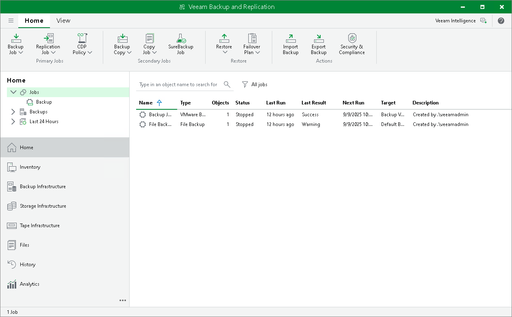

# Veeam Backup & Replication Console UI

The user interface of Veeam Backup & Replication desktop application is designed to let you quickly find commands that you need and perform data protection and disaster recovery tasks.

|  |
| --- |
| Tip |
| To open online help, press [F1] in any Veeam Backup & Replication wizard or window. You will be redirected to the required section of the user guide. |

Main Menu

The main menu in Veeam Backup & Replication contains commands related to general application settings. You can perform the following operations using the main menu:

* [VBR on Microsoft Windows] [Upgrade backup infrastructure components](components_update.md).
* [Update backup infrastructure components](update_appliances.md).
* [Manage credentials](credentials_manager.md).
* [Manage cloud credentials](cloud_credentials.md).
* [Manage passwords](password_manager.md).
* [Configure application settings](backup_settings.md).
* [Set up user roles](users_roles.md).
* [Configure malware detection settings](malware_detection.md).
* [Exclude VMs globally](global_exclusion.md).
* [Manage network traffic](managing_network_traffic.md).
* [Manage configuration database](vbr_config.md).
* Start PuTTy and Microsoft PowerShell consoles, and open a remote desktop connection to the backup server.
* [Change the color theme](change_color_theme.md).
* [Work with licenses](licensing.md).
* [View Veeam Backup & Replication help](http://www.veeam.com/documentation-guides-datasheets.html) and [export program logs](logging.md).
* Exit Veeam Backup & Replication.

Navigation Pane

The navigation pane, located on the left of the window, provides centralized navigation and lets you easily access Veeam Backup & Replication items organized in views.

The navigation pane consists of two areas:

* The upper pane, or the inventory pane, displays a hierarchy or list of items relevant to a specific view.

Items displayed in the inventory pane differ depending on the active view. For example, in the Backup Infrastructure view, the inventory pane displays a list of backup infrastructure components — virtualization servers, backup proxies, backup repositories, and so on. In the Inventory view, the inventory pane displays a list of servers added to the backup infrastructure.

* The lower pane contains a set of buttons that let you switch between views. For more information on views and how to show/hide a view button, see [Views](#views).

Ribbon and Tabs

Operation commands in Veeam Backup & Replication are organized in logical groups and displayed under tabs on the ribbon. The ribbon is displayed at the top of the main application window.

On the ribbon, the following tabs are displayed:

* The Home tab provides quick access to the most common operations. It lets you configure different types of jobs, perform restore and import operations. This tab is always available, no matter which view is currently active.
* Other tabs contain commands specific for certain items and appear when these items are selected. For example, if you open the Home view and select a backup job in the working area, the Job tab containing buttons for operations with jobs will appear on the ribbon. If you open the Files view and select a file or folder, the File Tools tab containing buttons for operations with files will appear on the ribbon.

|  |
| --- |
| Tip |
| Commands for operations with items in Veeam Backup & Replication are also available from the shortcut menu. |

You can minimize the ribbon. To do that, right-click the area with buttons on the ribbon and select Minimize the Ribbon. To restore the ribbon, right-click on the minimized ribbon and clear the Minimize the Ribbon option.

Views

Veeam Backup & Replication displays its items in views. When you click the button of a specific view in the navigation pane, the view content is displayed in the working area of Veeam Backup & Replication.

Veeam Backup & Replication offers the following views:

* The Home view is intended for work with jobs. It also displays a list of created backups and replicas that can be used for various restore operations, and provides statistics for recently performed jobs. For more information about job statistics, see [Reporting](reporting.md).
* The Inventory view displays the inventory of the virtual infrastructure. The inventory can be presented from different perspectives: Computer, Storage, VM Folders, VM Tags and vCloud. You can use this view to work with VMs, and VM containers or groups.
* The Backup Infrastructure view displays a list of backup infrastructure components: servers, hosts, backup proxies, backup repositories and so on. You can use this view for backup infrastructure setup — here you can configure backup infrastructure components that will be used for data protection and disaster recovery tasks.

* [For VMware vSphere environments] The Storage Infrastructure view displays a list of storage systems, volumes and snapshots. You can use this view to restore VM data from storage snapshots.
* The Tape Infrastructure view displays a hierarchy of tape libraries connected to the tape server. You can use this view to archive data to tapes and restore data from tapes.
* The Cloud Connect Infrastructure view displays components of the Veeam Cloud Connect infrastructure. This view can be used by SP to manage TLS certificates, configure cloud gateways and create accounts for users who plan to work with cloud resources.

* The Files view displays a file tree of servers added to the backup infrastructure. You can use this view for file copying operations.
* The History view displays statistics on operations performed with Veeam Backup & Replication. For more information, see the [Viewing History Statistics](history_statistics.md) section.
* The Analytics view (available if [Veeam ONE](https://helpcenter.veeam.com/docs/one/userguide/predefined_dashboards.html?ver=13) is integrated) consists of two parts:

* The Dashboards section displays the following Veeam ONE dashboards for monitoring infrastructure and data protection operations and allows updating their parameters:

* [Veeam Threat Center](https://helpcenter.veeam.com/docs/one/userguide/data_protection_platform.html?ver=13)
* [Backup Overview](https://helpcenter.veeam.com/docs/one/userguide/vbr_dashboard.html?ver=13)
* [Backup Heatmap](https://helpcenter.veeam.com/docs/one/userguide/heatmap_dashboard.html?ver=13)
* [Jobs Calendar](https://helpcenter.veeam.com/docs/one/userguide/job_calendar.html?ver=13)

* The Reports section allows generating, viewing, and managing both predefined and custom reports available in Veeam ONE. Use this section to access detailed insights into your backup infrastructure, configuration, compliance, and operational trends.

Reports cover a wide range of topics, including backup inventory, repository usage, security compliance, capacity planning, change tracking, and more. You can select from the available report templates or run custom reports tailored to your environment’s needs.

For a detailed description of reports and their capabilities, see the [Veeam ONE User Guide](https://helpcenter.veeam.com/docs/one/userguide/reports.html?ver=13).

To enable the Analytics view, add your Veeam Backup & Replication server to the Veeam ONE infrastructure, as described in the [Veeam ONE User Guide](https://helpcenter.veeam.com/docs/one/userguide/backup_server_connect.html?ver=13). Do not forget to select the Allow Veeam Backup & Replication to display analytics data check box. To learn how to configure this view, see [Configuring Analytics View](configure_analytics.md).

In some situations, some views may not be displayed. Consider the following:

* Right after installation, Veeam Backup & Replication displays only Backup Infrastructure and History views. To display other views, you must add at least one server or virtualization host to the backup infrastructure.
* Right after installation, Veeam Backup & Replication does not save changes that you make to the navigation pane or views: for example, if you resize panes, display or hide specific views. After you restart the Veeam Backup & Replication console, the main window settings are back to default ones. To save these settings, you must add at least one server or virtualization host to the backup infrastructure.
* Views can be shown as icons if they do not fit into the pane. To show the views in the full size, drag and drop the upper border of the pane.
* To display the Cloud Connect Infrastructure view, you must install a valid license that supports the Veeam Cloud Connect functionality.
* The Analytics view is available if you have the Microsoft Edge WebView2 Runtime component installed. The component is not installed for Microsoft Windows Server 2012 and 2012 R2 due to the version incompatibility, so the Analytics view is not available for the backup server running these Microsoft Windows versions.

You can hide views that you do not plan to use. For example, if you do not use tapes for data archiving, you can hide the Tape Infrastructure view. To hide a view:

1. Click the three dots icon () at the bottom of the navigation pane.
2. Click the view in the list.

You can minimize the views buttons and place them at the top or the bottom of the navigation pane. To do that:

1. Click the three dots icon () at the bottom of the navigation pane.
2. Select the required option in the Tabs view group.

Working Area

The working area of Veeam Backup & Replication displays a list of items relating to a specific view.

The working area looks different depending on the view that is currently active. For example, if you open the History view, the working area will display a list of job sessions and restore tasks performed with Veeam Backup & Replication. If you open the Inventory view, the working area will display a list of VMs that reside on servers connected to Veeam Backup & Replication.

Every item is described with a set of properties that are presented as column headers. You can click column headers to sort items by a specific property. For example, to sort VMs by the amount of provisioned storage space, click the Provisioned Size header.

To hide or display properties, right-click a column header and, in the opened menu, clear or select check boxes near property names.

Job Filter

A job filter allows you to filter jobs by different parameters. For example, you can create a filter that will show only VM backup copy jobs.

Creating Job Filters

To create a filter, do the following:

1. Open the Home view.
2. In the [inventory pane](#navigation_pane), select the Jobs node. At the top of the working area, click the filter icon  and then Add new. Alternatively, right-click the Jobs node and select Add view.
3. In the Add View window, specify a filter name. The name can be up to 200 characters long.
4. If you want to show this filter as a subnode of the Jobs node in the inventory pane, select the Add this view to the job management tree check box.
5. In the Workload section, select workloads which jobs must process:

* Application — Veeam Backup & Replication will show Veeam Plug-In jobs and jobs in which SQL transaction log backup, Oracle archive log backup or PostreSQL WAL files backup is enabled.
* Cloud VM — Veeam Backup & Replication will show jobs that process VMs stored in clouds.
* File — Veeam Backup & Replication will show jobs that process files.
* Server — Veeam Backup & Replication will show Veeam Agent jobs that process servers. For more information on processed computer types, see [Selecting Protected Computer Type](agent_job_protection_mode.md).
* Workstation — Veeam Backup & Replication will show Veeam Agent jobs that process workstations. For more information on processed computer types, see [Selecting Protected Computer Type](agent_job_protection_mode.md).
* VM — Veeam Backup & Replication will show jobs that process VMs.

1. In the Job type section, select job types:

* Backup — backup jobs. For example, [VM backup jobs](backup_job.md) or [file backup jobs](file_share_backup_job.md).
* Backup copy — backup copy jobs. For example, [VM backup copy jobs](backup_copy_create.md) or [file backup copy jobs](file_share_backup_job.md).
* Copy — copy jobs. For example, [file copy jobs](file_copy.md) or [VM copy jobs](vm_copy.md).
* Replication — [replication jobs](replica_job.md).
* SureBackup — SureBackup jobs. For example, [SureBackup jobs for VMware vSphere](create_surebackup_job.md) or [SureBackup jobs for Microsoft Hyper-V](create_surebackupjob_hv.md).
* Tape — tape jobs. For example, [backup to tape jobs](creating_backup_to_tape_jobs.md) or [file to tape jobs](creating_file_to_tape_jobs.md).

1. In the Last result section, select statuses with which jobs must finish: Success, Warning or Failed.

Jobs that that have never started are considered as Failed.

1. In the Status section, select the states of jobs: Running, Inactive or Disabled.

Backup copy jobs in the Idle state are considered Inactive.

1. If you want to show jobs with a manually set High priority flag, select the High priority job check box. For more information on job priorities, see [Job Priorities](job_priorities.md).
2. If you want to show jobs that were inactive for some period of time, select the Last run is over N days ago check box and specify the period in days.
3. If you want to show jobs whose names include specific keywords, select the Job name includes check box and enter keywords.

To show jobs that include any of the specified keywords, separate these keywords by a semicolon without a space. For example, if you enter "Backup Job;Daily", Veeam Backup & Replication will show all jobs that include "Backup Job" or "Daily" keywords in their names.

|  |
| --- |
| Note |
| Only the user who creates filters can access them — that is, other users cannot use these filters. |

Editing and Deleting Job Filters

To edit or delete a job filter, do the following:

1. Open the Home view.
2. In the inventory pane, select the Jobs node.
3. At the top of the working area, click  All Jobs.
4. Hover the mouse over a filter that you want to edit or delete.
5. Click the three dots icon () next to the name of the filter that you want to edit or delete.
6. Select Edit view or Delete view.

If you have added the filter as a subnode of the Jobs node in the inventory pane, you can right-click the subnode and then click Edit view or Delete view.

Footer

The footer contains the following information, starting from left to right:

* The number of items you selected for further actions or the total number of items in the working area if no items are selected.
* The backup server which this Veeam Backup & Replication console is connected to. By default, the console connects to the backup server installed locally — localhost.
* The backup server build number.

|  |
| --- |
| Tip |
| You can also check this installation build number in Main Menu > Help > About. Build numbers follow a dotted x.x.x.x system. |

* The information about your license edition and its expiration date.

Related Topics

[Changing Color Theme](change_color_theme.md)

