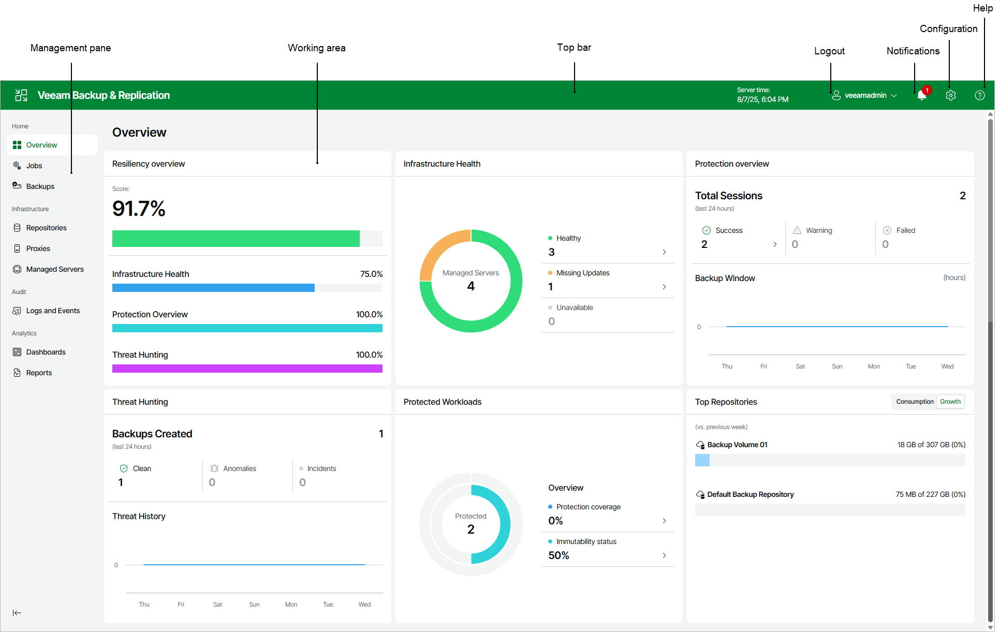

# Veeam Backup & Replication Web UI

In this article

The Veeam Backup & Replication web UI is a browser-based interface that enables you to manage backup and recovery operations, monitor your backup infrastructure, and configure system settings from any supported device. The web UI provides a modern, streamlined experience designed to simplify daily administration and deliver at-a-glance visibility into your data protection environment.

|  |
| --- |
| Important |
| Consider the following:   * The Veeam Backup & Replication web UI is not available in the Community Edition. A valid license is required to use this functionality. * Only the Veeam Backup Administrator can log in to the web UI. |

The overall look and feel of the Veeam Backup & Replication web UI is consistent with the Veeam product family, ensuring familiarity for users of the [Veeam Backup & Replication desktop application](vbr_ui.md) and [Veeam Enterprise Manager UI](https://helpcenter.veeam.com/docs/backup/em/em_know_ui.html?ver=13).

Management Pane

The management pane is located on the left side of the Veeam Backup & Replication web UI window. It provides structured access to all available dashboards and management areas. The management pane groups related functionality as follows:

Running Sessions

The Running Sessions section displays all active Instant VM Recovery sessions for [VMware vSphere](instant_recovery_review_vm_web.md) and [Microsoft Hyper-V](ir_finalize_hv_web.md) virtual machines. This view allows you to monitor and manage ongoing recovery operations directly from the Veeam Backup & Replication web UI.

Home

The Home section is designed for day-to-day data protection operations and monitoring. It includes dashboards that provide a holistic view of your backup environment and enable management of jobs and backups:

* The Overview dashboard presents a comprehensive summary of your backup environment, including:

* Resiliency Overview — A visual score reflecting the overall resiliency of your backup infrastructure.
* Infrastructure Health — Status of managed servers (online, offline, missing updates).
* Protection Overview — Recent session results, including counts of successful, warning, and failed backup jobs.
* Threat Hunting — Information about threats detected, backup anomalies, and incidents.
* Protected Workloads — Count of workloads under protection, with quick links to create new backup jobs.
* Top Repositories — Consumption and growth metrics for backup repositories.

* The Jobs dashboard displays a list of all backup and backup copy jobs configured in the environment. From this dashboard, you can:

* View job status, type, and last run information.
* Start, stop, or edit jobs.
* Monitor progress and review job history.
* Filter and sort jobs by various properties such as name, status, or last run time for efficient management.

* The Backups dashboard provides access to all available backup data within the environment. Here, you can:

* View a list of backup sets and restore points.
* Inspect backup properties such as backup type, repository location, creation date, and status.
* Initiate restore operations directly from the dashboard.
* Filter and sort backups to quickly locate specific recovery points.

Infrastructure

The Infrastructure section includes dashboards for managing backup infrastructure components:

* Repositories — Use this dashboard to manage backup storage repositories.
* Proxies — Use this dashboard to configure proxies for backup and recovery operations.
* Managed Servers — Use this dashboard to add, edit, or remove servers under Veeam management.

Audit

The Audit section provides access to logs and events for auditing administrative activity and job results. This includes:

* System and job event logs
* User activity tracking

Analytics

The Analytics section (available if [Veeam ONE](https://helpcenter.veeam.com/docs/one/userguide/predefined_dashboards.html?ver=13) is integrated) consists of two parts:

* The Dashboards section displays advanced dashboards for monitoring infrastructure and data protection operations, such as:

* [Veeam Threat Center](https://helpcenter.veeam.com/docs/one/userguide/data_protection_platform.html?ver=13)
* [Backup Overview](https://helpcenter.veeam.com/docs/one/userguide/vbr_dashboard.html?ver=13)
* [Backup Heatmap](https://helpcenter.veeam.com/docs/one/userguide/heatmap_dashboard.html?ver=13)
* [Jobs Calendar](https://helpcenter.veeam.com/docs/one/userguide/job_calendar.html?ver=13)

* The Reports section allows generating, viewing, and managing both predefined and custom reports available in Veeam ONE. Use this section to access detailed insights into your backup infrastructure, configuration, compliance, and operational trends.

Reports cover a wide range of topics, including backup inventory, repository usage, security compliance, capacity planning, change tracking, and more. You can select from the available report templates or run custom reports tailored to your environment’s needs.

For a detailed description of reports and their capabilities, see the [Veeam ONE User Guide](https://helpcenter.veeam.com/docs/one/userguide/reports.html?ver=13).

To enable the Analytics feature, add your Veeam Backup & Replication server to the Veeam ONE infrastructure, as described in the [Veeam ONE User Guide](https://helpcenter.veeam.com/docs/one/userguide/backup_server_connect.html?ver=13). Do not forget to select the Allow Veeam Backup & Replication to display analytics data check box.

Working Area

The working area of the Veeam Backup & Replication web UI displays a list or dashboard of items corresponding to the section selected in the management pane. The appearance of the working area adapts to the active dashboard:

* In the Jobs dashboard, the working area lists all jobs with columns such as Job Name, Type, Status, Last Run, Next Run, and Actions.
* In the Backups dashboard, the working area presents backup sets with properties like Job Name, Creation Time, Restore Points, Repository, Platform, and available actions.
* In the Infrastructure dashboards, the working area shows lists of repositories, proxies, or managed servers, each with relevant columns and controls.

Common Features:

* Each item in a list is described with a set of properties displayed as column headers.
* You can sort items by clicking on a column header (for example, to sort jobs by Last Run).
* To customize which properties are visible, click the three dots at the right of the header row and select or clear check boxes for property names.

Top Bar

The top bar is a persistent interface element displayed at the top of every page in the Veeam Backup & Replication web UI. It provides quick access to essential information and commonly used actions, helping administrators efficiently navigate and manage their data protection environment.

Top Bar Overview

The top bar includes the following elements (from left to right):

* Application Logo and Name displays the Veeam Backup & Replication logo and product name. Clicking the logo may return you to the main dashboard or landing page.

* Server Time shows the current date and time on the Veeam Backup & Replication server for reference during job monitoring and troubleshooting.

* User Profile Menu displays the currently logged-in user (for example, veeamadmin). Click the profile icon to log out or access user-specific settings.

* Notifications (Bell Icon) provides access to recent notifications, alerts, and important system messages. Notifications may include job results, license status, storage warnings, update availability, and other actionable items.

* Configuration (Gear Icon) opens the Configuration section in the management pane, giving access to global administrative options.

* Help (Question Mark Icon) opens the [Veeam Help Center](https://helpcenter.veeam.com/), offering access to online documentation and support resources.

Configuration Menu

Clicking the gear icon in the top bar opens the Configuration menu, which groups together global settings and administrative controls:

* Settings — Configure [notifications, storage thresholds, support contract expiration alerts](global_notifications_web.md), and event forwarding ([SNMP](general_snmp_settings_web.md), [Syslog](syslog_servers_add_web.md)).
* Credentials & Passwords — Manage [datacenter credentials](credentials_manager.md) and [encryption passwords](password_manager_create_web.md) for infrastructure and job security.
* License Information — [View the license information](view_license_web.md): current license status, product edition, support ID, and perform license management.
* Update Settings — [Manage update settings](update_appliance_configure_updates.md): update sources, schedule maintenance windows, and configure automatic security update policies.
* Veeam Intelligence — [Enable or disable AI-powered features](veeam_intelligence_settings_web.md) including knowledge base assistance and analytics.
* Appearance — [Customize the web UI appearance](change_color_theme_web.md): color scheme (light, dark, or system), navigation menu layout, and interface preferences.
* About — View information about the installed Veeam Backup & Replication version, access the [Veeam Updater](update_appliances.md) and [Veeam Host Management](hmc_about.md) interfaces, open the Swagger documentation, download the [Veeam Backup & Replication console](vbr_ui.md) [installer](install_console.md), collect and download logs, access the [Veeam Help Center](https://helpcenter.veeam.com/), [Veeam R&D Forums](https://forums.veeam.com/) and [Veeam Customer Support Portal](https://www.veeam.com/support.html).

Page updated 9/23/2025

Page content applies to build 13.0.1.1071
