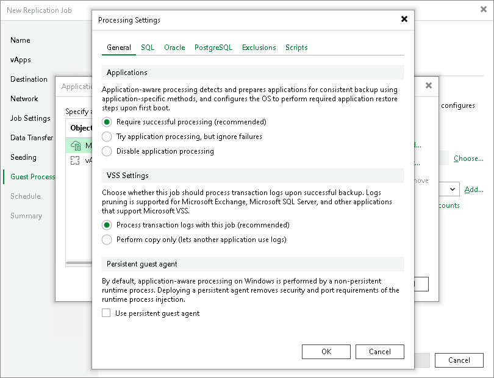

# Application-Aware Processing and Transaction Logs

Application-aware processing helps create transactionally consistent replicas. The transactionally consistent replicas guarantee proper recovery of applications without data loss. For more information on application-aware processing, see [Application-Aware Processing](application_aware_processing.md).

To configure general application-aware processing settings, you must check that application-aware processing is enabled and then specify whether Veeam Backup & Replication processes transaction logs or creates copy-only replicas.

Enabling Application-Aware Processing

Before configuring transaction log processing, check that application-aware processing is enabled:

1. At the Guest Processing step of the wizard, select the Enable application-aware processing check box.
2. Click Application handling options for individual machines.
3. In the displayed list, select workloads for which you want to configure application-aware processing and click Edit.

To define custom settings for a VM added as a part of a VM container, you must include the VM in the list as a standalone object. To do this, click Add and choose the necessary VM. Then select the VM in the list and define the necessary settings.

1. In the Processing Settings window, on the General tab, check that Require successful processing or Try application processing, but ignore failures option is selected in the Applications area.

Specifying Application-Aware Processing Settings

To configure application-aware processing settings:

1. [For Microsoft Exchange and Microsoft SQL Server] In the VSS Settings section, specify if Veeam Backup & Replication must process transaction logs or create copy-only replicas:

1. Select Process transaction logs with this job if you want Veeam Backup & Replication to process transaction logs.

[For Microsoft Exchange VMs] With this option selected, the non-persistent runtime components or persistent components running on the VM guest OS will wait for replication to complete successfully and then trigger truncation of transaction logs. If the replication job fails, the logs will remain untouched on the VM guest OS until the next start of the non-persistent runtime components or persistent components.

[For Microsoft SQL Server] You will need to configure how to process transaction logs.

|  |
| --- |
| Tip |
| To configure log processing for Oracle and PostgreSQL databases, switch to the Oracle and PostrgeSQL tabs. |

1. Select Perform copy only if you use another tool to perform guest level processing, and this tool maintains consistency of the database state. Veeam Backup & Replication will create a copy-only replica for the selected VMs. The copy only replica preserves the chain of full and differential files and transaction logs on the VM. For more information, see [Microsoft Docs](http://msdn.microsoft.com/en-us/library/ms191495.aspx).

1. [For Microsoft Windows VMs] In the Persistent guest agent section, select the Use persistent guest agent check box to use for application-aware processing persistent guest agents on each protected VM.

By default, Veeam Backup & Replication uses non-persistent runtime components. Veeam Backup & Replication deploys runtime components on each protected VM when the replication job starts, and removes the runtime components as soon as the replication job finishes.

For more information on guest agent and non-persistent components, see [Non-Persistent Runtime Components and Persistent Agent Components](runtime_process.md).

[For Linux VMs] To use persistent guest agents, you must install Management Agent on protected VMs. For more information, see [Persistent Agent Components](persistent_agent_components.md).

Related Topics

* [Microsoft SQL Server Transaction Log Settings](vcd_replication_sql_logs.md)
* [Oracle Archived Log Settings](vcd_replication_oracle_logs.md)

