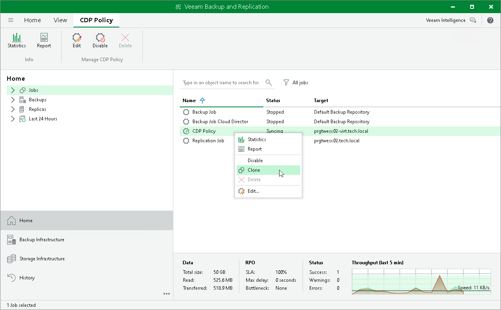

# Cloning Policies

In this article

You can create a new CDP policy by cloning an existing one. Policy cloning allows you to create an exact copy of any policy with the same policy settings.

The name of the cloned policy is formed by the following rule: <policy\_name\_clone1>, where policy\_name is the name of the original policy and clone1 is a suffix added to the original policy name. If you clone the same policy again, the number in the name will be incremented, for example, policy\_name\_clone2, policy\_name\_clone3, and so on.

Considerations and Limitations

When cloning a policy, Veeam Backup & Replication can change some policy settings so that cloned policies do not hinder original policies.

* Veeam Backup & Replication disables the cloned policy. To enable the cloned policy, select it in the policy list and click Disable on the ribbon. Alternatively, right-click the policy and select Disable.
* Before enabling the policy, you must edit the list of protected workloads. One workload can be protected only by one CDP policy.
* In the cloned policy, you cannot change the target destination.

Cloning Policy

To clone a CDP policy:

1. Open the Home view.
2. In the inventory pane, select Jobs.
3. In the working area, select the policy and click Clone on the ribbon. Alternatively, right-click the policy and select Clone.

After the policy is cloned, you can edit its settings, including the policy name.

Page updated 12/16/2024

Page content applies to build 13.0.1.1071
