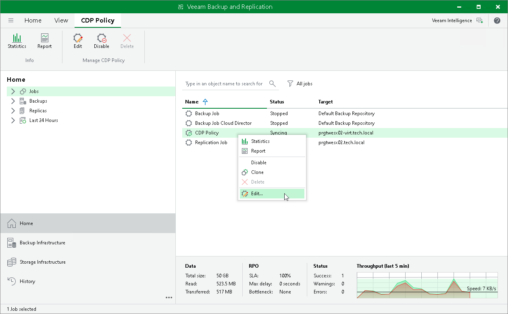

# Editing Policies

To edit a CDP policy:

1. Open the Home view.
2. In the inventory pane, navigate to the Jobs > CDP node.
3. In the working area, select the necessary policy and select Edit on the ribbon. As an alternative, right-click the necessary policy and select Edit.
4. Follow the instructions provided in the Creating CDP Policies section.

Related Topics

[Creating Cloud Director CDP Policies](vcd_cdp_policies_create.md)

