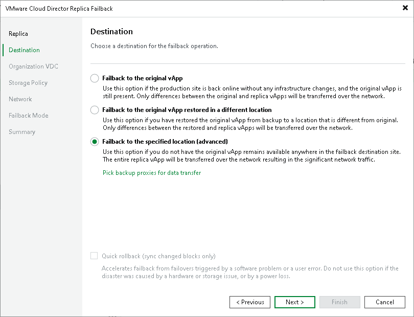

# Step 3. Select Failback Destination

At the Destination step of the wizard, select the failback destination and backup proxies for vApp data transport during failback:

1. Select a destination for failback. Veeam Backup & Replication supports the following options:

* Failback to the original vApp — select this option if you want to fail back to the source vApps that reside on the source hosts. Veeam Backup & Replication will synchronize the state of the source vApps with the current state of their replicas to apply any changes that occurred to the replicas while running in the disaster recovery (DR) site.

If this option is selected, you will proceed to the Failback Mode step of the wizard.

* Failback to the original vApp restored in a different location — select this option if the source vApps have already been recovered to a new location, and you want to switch to the recovered vApps from their replicas. Veeam Backup & Replication will synchronize the state of the recovered vApps with the current state of the vApp replicas to apply any changes that occurred to the replicas while running in the DR site.

If this option is selected, you will proceed to the Target vApp step of the wizard.

|  |
| --- |
| Tip |
| You can restore to another VMware Cloud Director. |

* Failback to the specified location — select this option if you want to recover the source vApps from replicas. You can recover vApps to a new location, or to any location but with different settings (such as network settings, virtual disk type, configuration file path and so on). Select this option if there is no way to fail back to the source vApp or an already recovered vApp.

If you select this option, the wizard will include additional steps.

If you select one of the first two options, Veeam Backup & Replication will send to the source/recovered vApps only differences between the existing virtual disks of VMs included in the vApps. Veeam Backup & Replication will not send replica configuration changes such as different IP address or network settings (if replica Re-IP and network mapping were applied), new hardware or virtual disks added while the replicas were in the Failover state.

If you select Failback to the specified location, Veeam Backup & Replication will send to the specified location whole replica data, including configurations and virtual disk content.

1. To select which backup proxies will be used for data transfer, click Pick backup proxies for data transfer.

By default, Veeam Backup & Replication selects proxies automatically. Before processing a new vApp in the vApp list, Veeam Backup & Replication checks available backup proxies. If more than one backup proxy is available, Veeam Backup & Replication selects the most appropriate proxy basing on the following information: transport modes that the backup proxies can use and the current workload on the backup proxies.

If want to select proxies manually and if vApps and their replicas reside in different sites, select at least one backup proxy in the production site and one proxy in the disaster recovery site. If vApps and replicas reside in the same site, you can use the same backup proxy as the source and target one.

We recommend that you select at least two backup proxies in each site to ensure that failback will be performed in case one proxy fails or looses the network connection.

1. [For failback to the source vApps] If you want to fasten failback, and the source vApps had problems at the guest OS level, select the Quick rollback check box.

Restoring Storage Policies

If the replicated vApp was associated with the storage policy, in the failback to original location scenario, Veeam Backup & Replication will associate the restored vApp with this storage policy.

When you click Next, Veeam Backup & Replication will check storage policies in the virtual environment and compare this information with the information about the replica storage policy. If the original storage policy has been changed or deleted, Veeam Backup & Replication will display a warning. You can select one of the following options:

* Current — the restored VM will be associated with the profile with which the source VM in the production environment is currently associated.
* Default — the restored VM will be associated with the profile that is set as default for the target datastore.
* Stored — the restored VM will be associated with the profile that was assigned to the source VM at the moment of replication.

For more information, see [Storage Profiles](storage_profile_restore.md).

