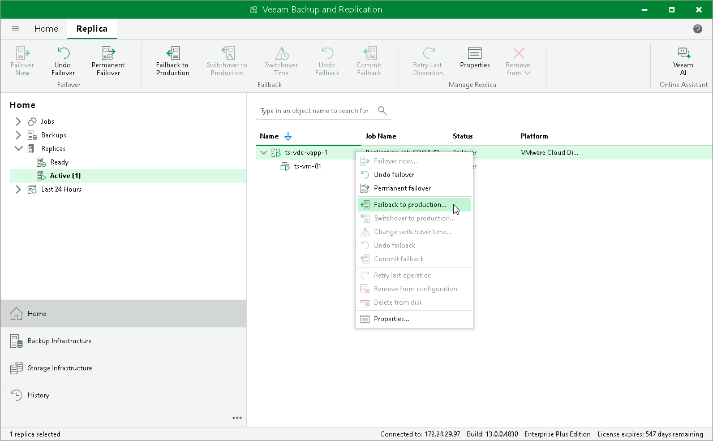

# Step 1. Launch Failback Wizard

In this article

To launch the Failback wizard, do one of the following:

* On the Home tab, click Restore > VMware Cloud Director > Restore from replica > Entire vApp > Failback to production.
* Open the Home view, in the inventory pane select Replicas > Active. In the working area, right-click the necessary replica and select Failback to production. Alternatively, click Failback to Production on the ribbon.

Page updated 1/25/2024

Page content applies to build 13.0.1.1071
