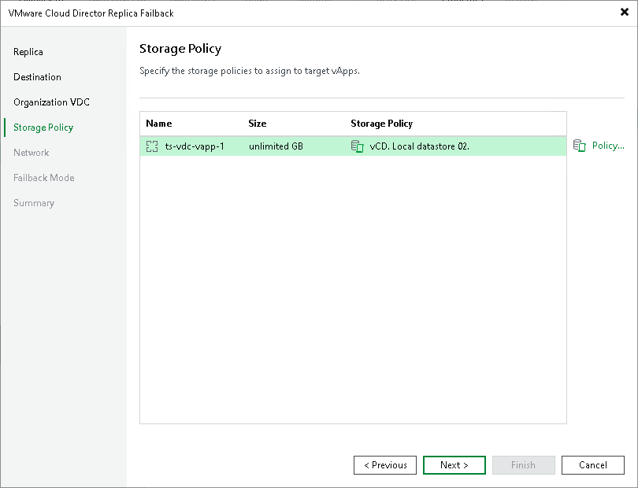

# Step 5. Specify Storage Policies

The Storage Policy step is available if you have selected the Failback to the specified location option at the Destination step.

At the Storage Policy step of the wizard, specify storage policies that Veeam Backup & Replication will apply to vApps that you want to restore:

1. In the vApps list, select vApps for which you want to change the policy and click Policy.
2. In the Select storage policy window select the policy that you want to apply.

