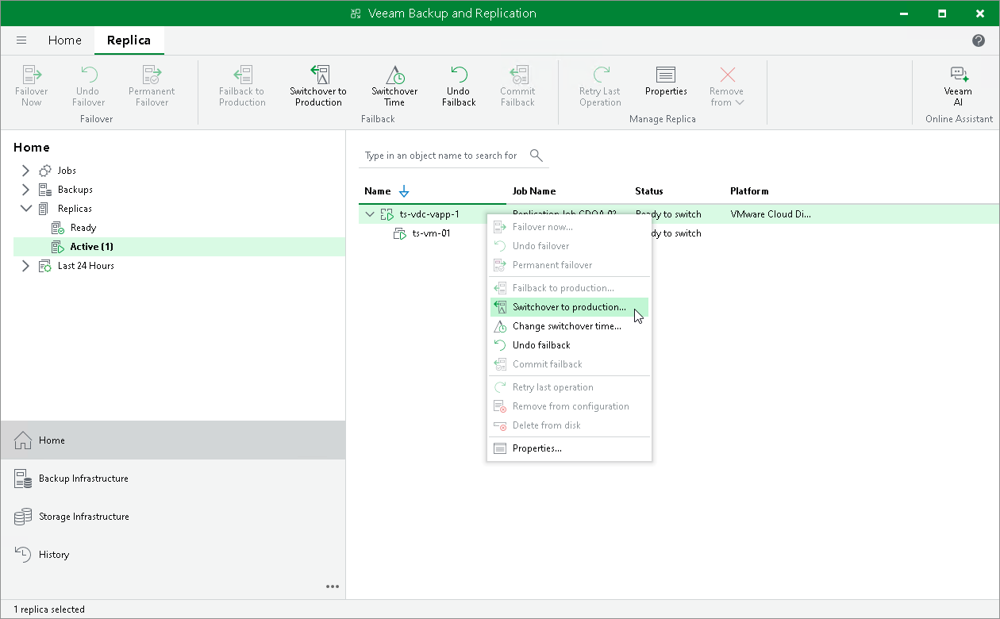

# Switching to Production vApps Manually

The following instructions apply if you have selected to switch from replicas to production vApps manually at the Failback Mode step of the Failback wizard.

To switch to a production vApp from its replica, do the following:

1. Open the Home view.
2. In the inventory pane, navigate to the Replicas > Active node.
3. In the working area, select the necessary vApp and select Switchover to production on the ribbon. As an alternative, you can right-click the necessary vApp and select Switchover to production.

If the switch to production operation failed, you can retry this operation again. To perform a retry, in the working area, select the necessary vApp and select Retry Switchover to Production on the ribbon. Alternatively, you can right-click the necessary vApp and select Retry switchover to production.

What You Do Next

After you switch to the production VM, you must finalize failback. You can finalize failback in the following ways:

* [Commit failback](vcd_cdp_failback_commit.md)
* [Undo failback](vcd_cdp_failback_undo.md)

