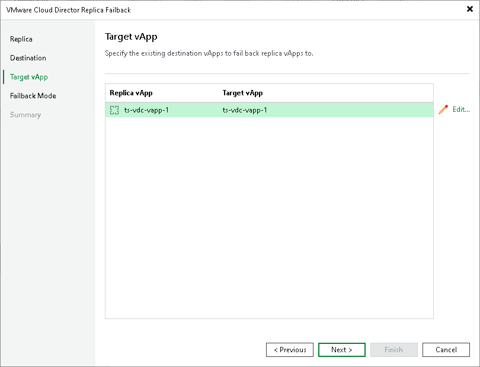

# Step 7. Select Target vApp

The Target vApp step is available if you have selected the Failback to the original VM restored in a different location option at the Destination step.

At the Target vApp step of the wizard, specify to which vApps you want to fail back from replicas. These vApps must be already restored from backups in the required location.

By default, Veeam Backup & Replication fails back the replica to the source vApps. If you want to specify the target vApp manually, perform the following steps:

1. Select a replica and click Edit.
2. In the Selects Objects window, select a vApp or vApp container to which you want to fail back.
3. Click Add.

