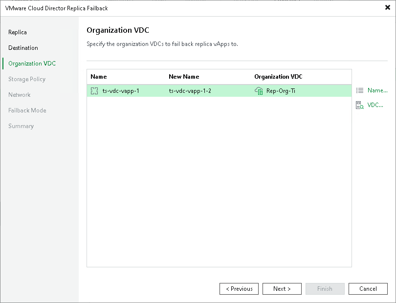

# Step 4. Specify Organization VDCs

The Organization VDC step is available if you have selected the Failback to the specified location option at the Destination step.

At the Organization VDC step of the wizard, specify names for the restored vApps and the organization VDCs to which Veeam Backup & Replication will add restored vApps. To do this, select the necessary vApp and use the Name and VDC buttons.

