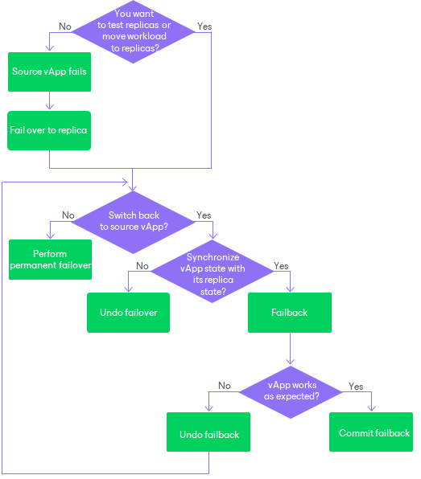

# Failover and Failback for Cloud Director CDP

In this article

Failover and failback are operations that allow you to manage your production and disaster recovery (DR) sites if a disaster strikes. Failover is a process of switching from the vApp on the source organization VDC to its replica on a target organization VDC that is set up as the disaster recovery (DR) site. Failback is a process of returning from the replica to the source vApp or a new vApp.

Veeam Backup & Replication provides the following failover and failback operations:

* Perform failover

When you perform failover, you shift all processes from the source vApp in the production organization VDC to the replica in the DR organization VDC. Failover is an intermediate step that needs to be finalized: you can perform permanent failover, perform failback or undo failover.

* Perform permanent failover

When you perform permanent failover, you permanently switch from the source vApp to a replica and use this replica as the production vApp. The source vApp is excluded from VMware Cloud Director replica processing.

* Undo failover

When you undo failover, you switch back to the source vApp and discard all changes made to the replica while it was running. For example, you can use the undo failover scenario if you have failed over to the replica for testing and troubleshooting purposes, and you do not need to synchronize the source vApp state with the current state of the replica.

* Perform failback

When you perform failback, you switch back to the source vApp and send to the source vApp all changes that took place while the replica was running. If the source organization VDC is not available, you can recover a vApp with the same configuration as the source vApp and switch to it.

When you perform failback, changes are only sent to the source or recovered vApp but not published. You must test whether the source or recovered vApp works with these changes. Depending on the test results, you can do the following:

* Commit failback. When you commit failback, you confirm that the source or recovered vApp works as expected and you want to get back to it.
* Undo failback. When you undo failback, you confirm that the source or recovered vApp is not working as expected and you want to get back to the replica.

The following scheme can help you decide which steps are preferable when you fail over to a replica.

Related Topics

* [Failover](vcd_cdp_failover.md)
* [Permanent Failover](vcd_cdp_perm_failover.md)
* [Failover Undo](vcd_cdp_failover_undo.md)
* [Failback](vcd_cdp_failback.md)
* [Failback Undo](vcd_cdp_failback_undo.md)
* [Failback Commit](vcd_cdp_failback_commit.md)

Page updated 8/18/2023

Page content applies to build 13.0.1.1071
