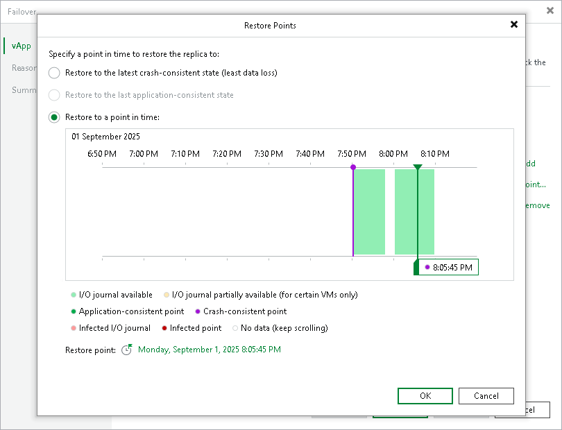

# Step 3. Select Restore Points

In this article

At the vApp step of the wizard select to which state of replicas you want to fail over:

1. In the vApp list, select the necessary vApp and click Point.
2. In the Restore Points window, select to which restore point you want to fail over:

* Latest crash-consistent restore point. In this case, you will lose the least amount of data.
* Latest long-term application-consistent restore point. In this case, you will be able to restore specific application data.
* Specific point in time. In this case, you will restore to any selected restore point.

To restore to a short-term restore point, select a point in the green area. To restore to a crash-consistent or application consistent long-term point, select a violet or turquoise vertical bar with a circle at the top. A yellow restore point (a short-term restore point in the yellow area or a long-term restore point as a vertical bar) indicates that the point is in the mixed state. This means that some VMs were powered off, not processed successfully, have different states — crash-consistent and application-consistent, and so on. In this case, Veeam Backup & Replication will suggest to restore the VMs on the nearest short-term restore point.

Use the right and left arrows on the keyboard to select the required restore point. To quickly find a long-term restore point, click a link that shows a date. In the opened window, you will see a calendar where you can select the necessary day. In the Timestamp section, you will see long-term restore points created during the selected day.

Page updated 9/27/2023

Page content applies to build 13.0.1.1071
