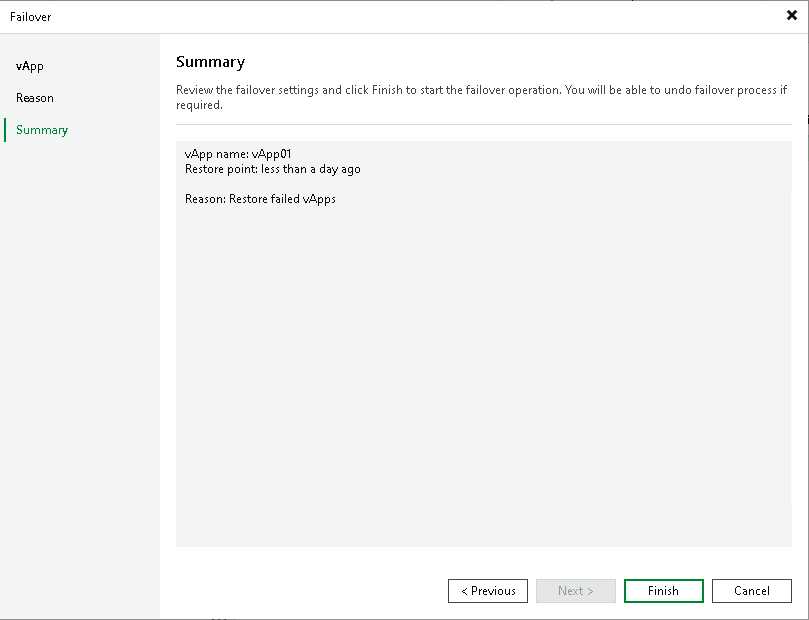

# Step 5. Finish Working with Wizard

In this article

At the Summary step of the wizard, review details of the failover task. Then click Finish to start the failover process.

When the failover process is complete, the replicas will be started on the target hosts.

What You Do Next

Failover is an intermediate step that needs to be finalized. You can finalize failover in the following ways:

* Perform permanent failover
* Undo failover
* Perform failback

Page updated 1/25/2024

Page content applies to build 13.0.1.1071
