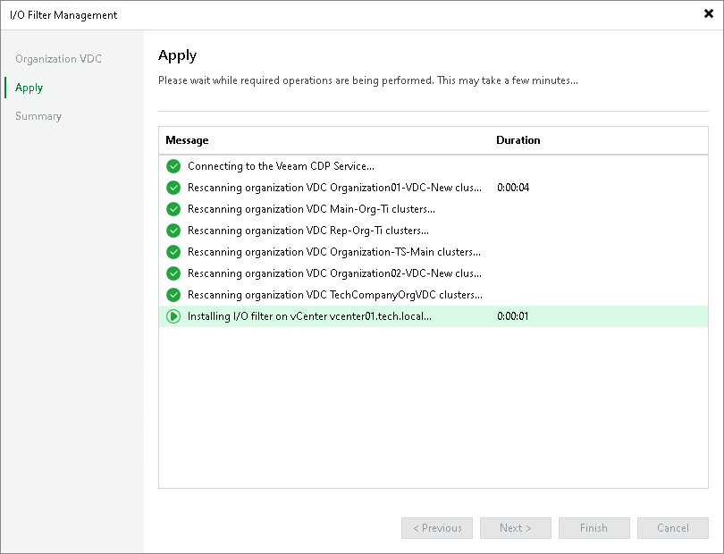

# Step 3. Apply Filter Settings

In this article

At the Apply step of the wizard, wait untill Veeam Backup & Replication installs the I/O filter. Click Next.

Page updated 1/18/2024

Page content applies to build 13.0.1.1071
