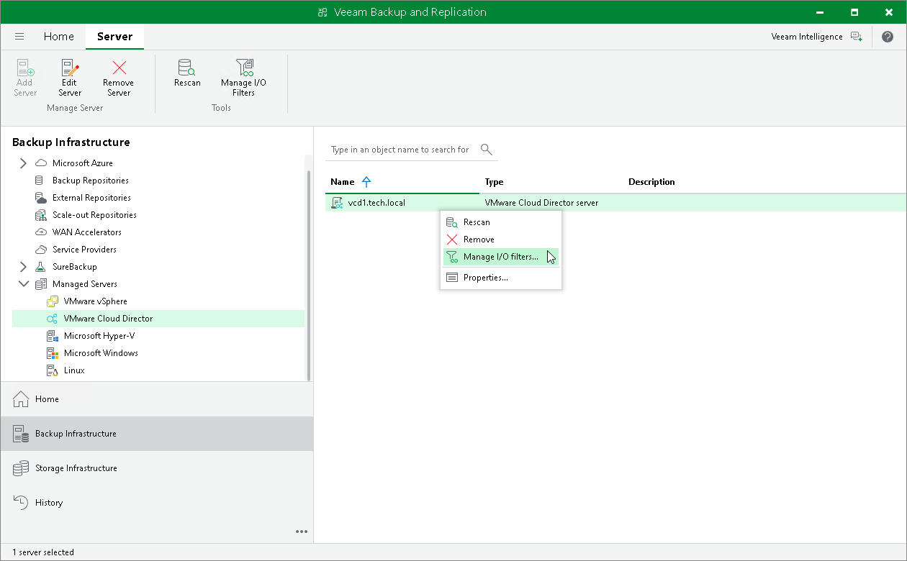

# Step 1. Launch I/O Filter Management Wizard

To launch the I/O Filter Management wizard, do one of the following:

* Open the Backup Infrastructure view. In the inventory pane, navigate to the Managed Servers > VMware Cloud Director. In the working area select a VMware Cloud Director server on which you want to install the filter. Right-click the servers and select Manage I/O filters. Alternatively, click Manage I/O Filters on the ribbon.

* Open the Inventory view. Click the View tab on the ribbon and click Cloud Director View. In the inventory pane, navigate to the VMware Cloud Director > VMs and vApps > <Cloud Director Server > node. Right-click the node and select Manage I/O filters. Alternatively, click Manage I/O Filters on the ribbon.

