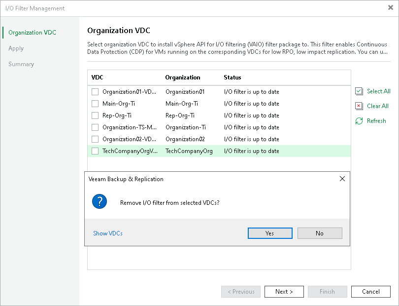

# Updating and Uninstalling I/O Filter

In this article

Veeam Backup & Replication allows you to update or uninstall the I/O filter from organization VDCs using the Veeam Backup & Replication console.

Requirements

Consider the following:

* Make sure that you have disabled or deleted all VMware Cloud Director CDP policies as described in section [Disabling and Deleting Policies](vcd_cdp_disable.md).
* [When uninstalling the filter] If you have manually assigned the Veeam CDP Replication storage policy to VMs that are parts of organization VDCs to which the filter was installed, or replicas are still present in the Veeam Backup & Replication configuration database, you must change the storage policy for these VMs.

For more information on how to change storage policies, see [VMware Docs](https://docs.vmware.com/en/VMware-vSphere/7.0/com.vmware.vsphere.storage.doc/GUID-D6A099C5-8F80-474C-A79A-64F5EC4455DA.html). To see the list of replicas, open the Home view. In the inventory pane, click the Replicas node.

Updating or Uninstalling I/O Filter

To update or uninstall the I/O filter, do the following:

1. Launch the I/O Filter Management wizard as described in section [Launch VeeamCDP Filter Management Wizard](vcd_cdp_io_filter_launch.md).
2. At the Organization VDC step of the wizard, do the following:

* To update the filter, make sure that check boxes are selected near the necessary organization VDCs.
* To uninstall the filter, clear the check boxes near the necessary organization VDCs.

1. Proceed to the last step of the wizard and close the wizard.

Page updated 10/17/2025

Page content applies to build 13.0.1.1071
