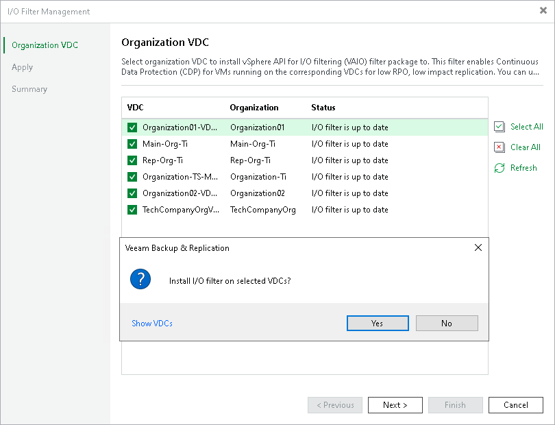

# Step 2. Select VDC Organizations

In this article

At the Organization VDC step of the wizard, select check boxes near organization VDCs on which you want to install the I/O filter.

If you select check boxes near VDCs where the filters are installed, Veeam Backup & Replication will update the filters. If you clear check boxes, Veeam Backup & Replication will delete the I/O filter from these VDCs. For more information, see [Updating and Uninstalling I/O Filter](vcd_cdp_io_filter_uninstall.md).

|  |
| --- |
| Note |
| If you add a new organization VDC to the Cloud Director server after the I/O filter is installed on the existing VDCs, you need to install the I/O filter manually on the newly added VDC. To do that, open the I/O Filter Management wizard, make sure that check boxes are selected near the organization VDCs where the I/O filter must be present and finish the wizard. |

Page updated 1/18/2024

Page content applies to build 13.0.1.1071
