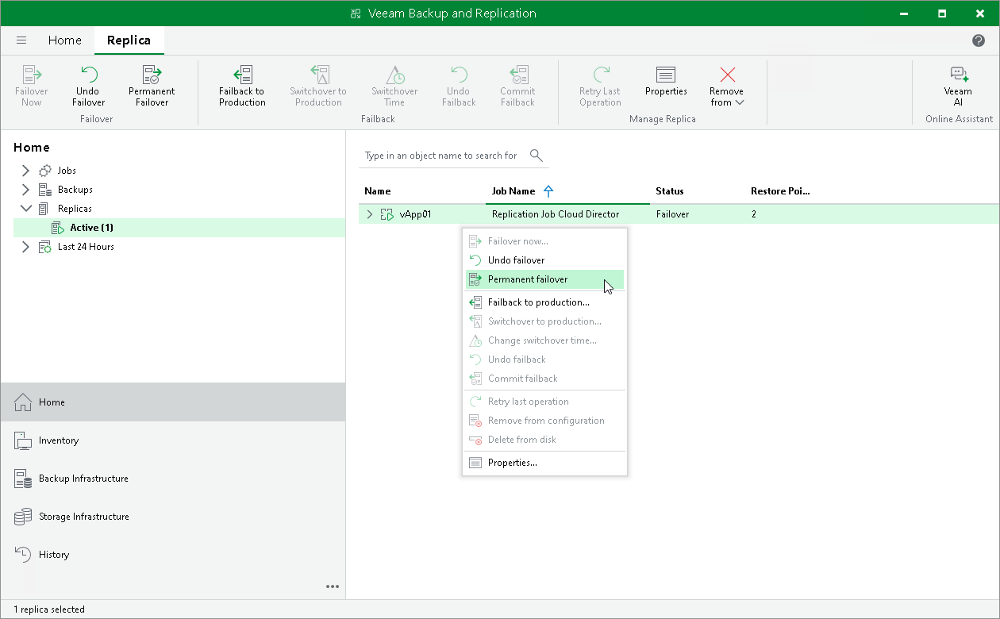

# Performing Permanent Failover

In this article

For more information on permanent failover, see [Failover and Failback for Cloud Director CDP](vcd_cdp_failover_failback.md) and [Permanent Failover](vcd_cdp_perm_failover.md).

To perform permanent failover, do one of the following:

* Open the Home view. In the [inventory pane](vbr_ui.md) navigate to the Replicas > Active node. In the working area, select the necessary replica and click Permanent Failover on the ribbon.
* Open the Home view. In the [inventory pane](vbr_ui.md) navigate to the Replicas > Active node. In the working area, right-click the necessary replica and select Permanent failover.

Page updated 1/24/2025

Page content applies to build 13.0.1.1071
