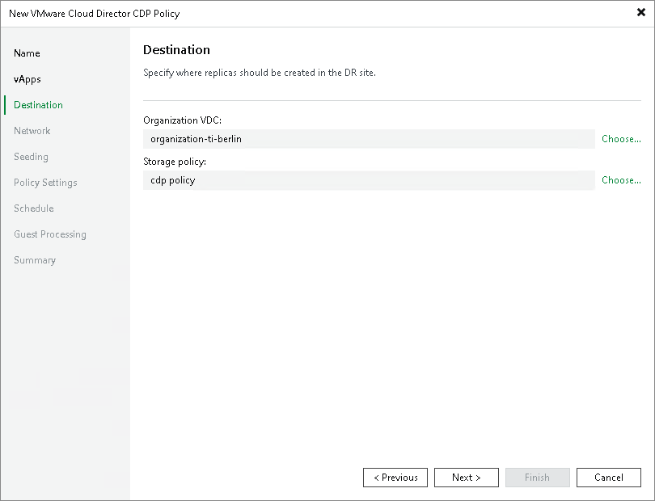

# Step 6. Select Replica Destination

At the Destination step of the wizard, select an organization VDC where you want to store replicas and the storage policy that you want to apply to the replicas.

