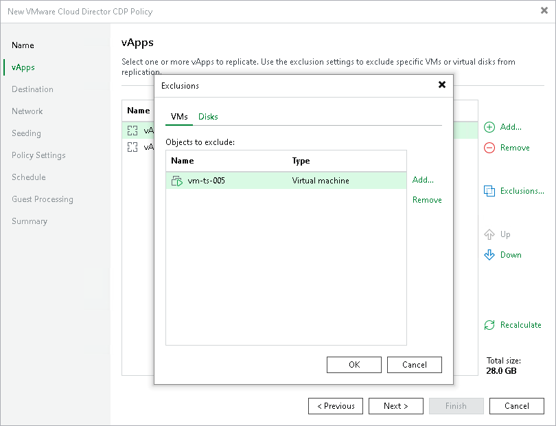
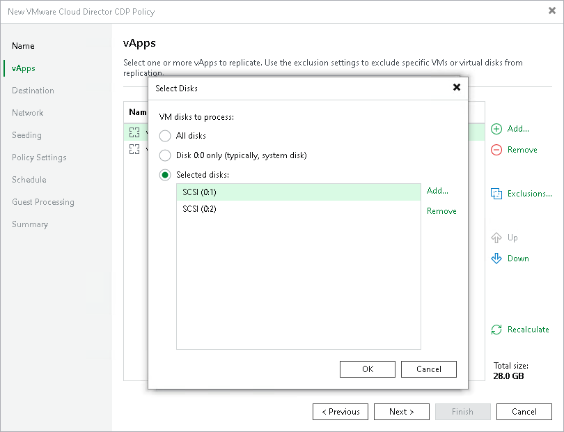

# Step 4. Exclude Objects

After you have added vApps and VM containers to the replication job, at the vApps step of the wizard you can specify which objects you want to exclude from the replication job.

|  |
| --- |
| Note |
| You can exclude only child objects that are added to a VM container. For example, if you add an organization VDC to a replication job, you can exclude only vApps that are available in this organization VDC. |

Excluding VMs and VM Containers

To exclude VMs and VM containers (vApps, organizations, organization VDCs and so on):

1. At the vApps step of the wizard, click Exclusions.
2. In the Exclusions window, check that the VMs tab is selected. Click Add.
3. In the Select Objects window, select VMs and VM containers that you want to exclude. Click OK.

Select the Show full hierarchy check box to display the hierarchy of all VMware Cloud Director servers added to the backup infrastructure.

Excluding Disks

To exclude disks:

1. At the vApps step of the wizard, click Exclusions.
2. In the Exclusions window, do the following:

1. Switch to the Disks tab.
2. To exclude disks of VMs, click Add. In the Add Objects window, select the necessary VMs and click Add. Veeam Backup & Replication will include these VMs in the list as standalone objects.
3. In the Disks to process list, select the necessary VMs.
4. Click Edit.

1. In the Select Disks window, select disks that you want to replicate: all disks, 0:0 disks (as a rule, system disks) or specific IDE, SCSI, SATA or NVMe disks. Disks that you do not select will be excluded from processing. Click OK.
2. In the Exclusions window, click OK.

