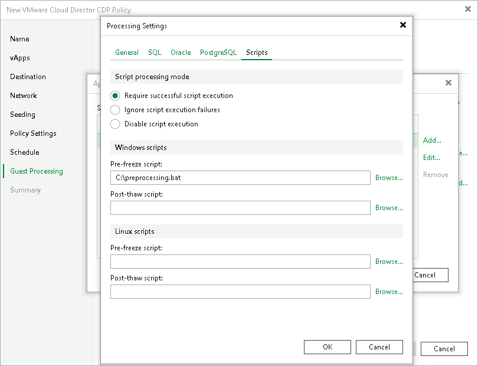

# Script Settings

You can instruct Veeam Backup & Replication to run custom scripts before the CDP policy starts the creation of a long-term restore point and after the policy finishes the creation. For example, these can be pre-freeze and post-thaw scripts for a VM that does not support VSS. The scripts will quiesce the VM file system and application data to bring the VM to a consistent state before the creation of a restore point, and bring the VM and applications to their initial state after the creation finishes.

To specify pre-freeze and post-thaw scripts, you must check that application-aware processing is enabled and then specify script settings.

Enabling Application-Aware Processing

Before configuring transaction log processing, check that application-aware processing is enabled:

1. At the Guest Processing step of the wizard, select the Enable application-aware processing check box.
2. Click Application handling options for individual machines.
3. In the displayed list, select workloads for which you want to configure application-aware processing and click Edit.

To define custom settings for a VM added as a part of a VM container, you must include the VM in the list as a standalone object. To do this, click Add and choose the necessary VM. Then select the VM in the list and define the necessary settings.

1. In the Processing Settings window, on the General tab, check that Require successful processing or Try application processing, but ignore failures option is selected in the Applications area.

Specifying VM Guest OS File Exclusion Settings

To configure scripts:

1. In the Processing Settings window, switch to the Scripts tab.
2. In the Script processing mode section, select a scenario for script execution:

+ Select Require successful script execution if you want Veeam Backup & Replication to stop the replication process if scripts fail.
+ Select Ignore script execution failures if you want to continue the replication process even if script errors occur.
+ Select Disable script execution if you do not want to run scripts for the VM.

1. In the Windows scripts section, specify paths to scripts for Microsoft Windows VMs. For the list of supported script formats, see [Pre-Freeze and Post-Thaw Scripts](pre_post_scripts.md).
2. In the Linux scripts section, specify paths to scripts for Linux VMs. For the list of supported script formats, see [Pre-Freeze and Post-Thaw Scripts](pre_post_scripts.md).

If you plan to replicate a VM container with Microsoft Windows and Linux VMs, you can select to execute both Microsoft Windows and Linux scripts. When replication starts, Veeam Backup & Replication will automatically determine which OS type is installed on the VM and use the correct scripts for this VM.

