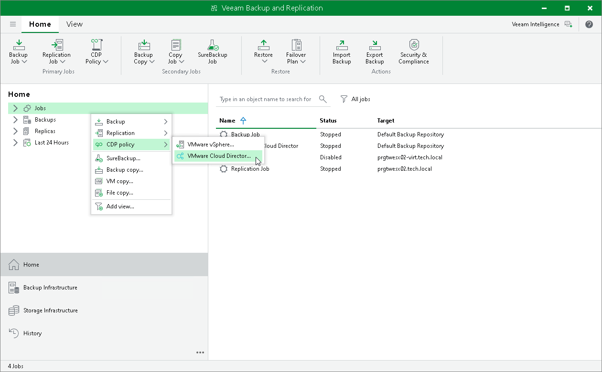

# Step 1. Launch New VMware Cloud Director CDP Policy Wizard

In this article

To launch the New VMware Cloud Director CDP Policy wizard, do one of the following:

* Open the Home view. On the ribbon, click CDP Policy > VMware Cloud Director.
* Open the Home view. In the inventory pane, right-click Jobs and select CDP Policy > VMware Cloud Director.

* Open the Inventory view. In the inventory pane, right-click workloads that you want to replicate. Select Add to CDP policy > New job if you want to create a new VMware Cloud Director CDP policy, or Add to CDP policy > <Policy Name> if you want to add workloads to an existing VMware Cloud Director CDP policy.

Page updated 1/25/2024

Page content applies to build 13.0.1.1071
